<div align="center">

# ScanMe

## Benutzerhandbuch

**Papier scannen, in Dokumente trennen, ablegen und archivieren**

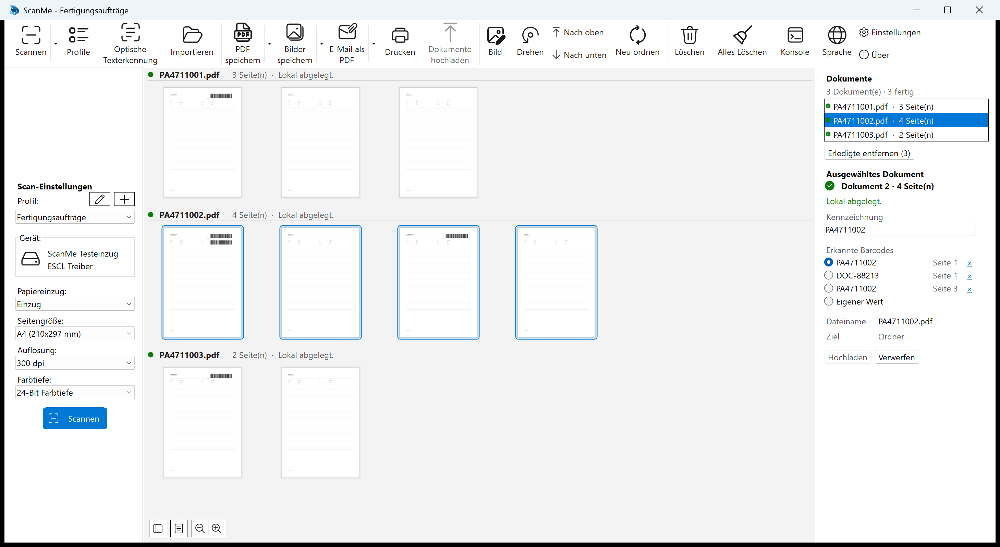

Version 1.1 · Stand August 2026

**up in blue GmbH**

</div>

<!-- pagebreak -->

## Inhalt

1. [Über dieses Handbuch](#1-über-dieses-handbuch)
2. [Was ScanMe macht](#2-was-scanme-macht)
3. [Das Fenster](#3-das-fenster)
4. [Ein Scan von Anfang bis Ende](#4-ein-scan-von-anfang-bis-ende)
5. [Dokumente prüfen und korrigieren](#5-dokumente-prüfen-und-korrigieren)
6. [Wenn falsch getrennt wurde](#6-wenn-falsch-getrennt-wurde)
7. [Seiten bearbeiten](#7-seiten-bearbeiten)
8. [Speichern, Drucken, E-Mail, Importieren](#8-speichern-drucken-e-mail-importieren)
9. [Die Konsole](#9-die-konsole)
10. [Einstellungen](#10-einstellungen)
11. [Wenn etwas nicht klappt](#11-wenn-etwas-nicht-klappt)
12. [Tastaturbefehle](#12-tastaturbefehle)
13. [Anhang A – Profile einrichten](#anhang-a--profile-einrichten)
14. [Anhang B – Begriffe](#anhang-b--begriffe)
15. [Anhang C – Wo ScanMe seine Daten ablegt](#anhang-c--wo-scanme-seine-daten-ablegt)

<!-- pagebreak -->

# 1. Über dieses Handbuch

Dieses Handbuch richtet sich an alle, die mit ScanMe **Papier scannen und archivieren**. Die Kapitel 2
bis 12 beschreiben die tägliche Arbeit und setzen voraus, dass jemand die Profile bereits eingerichtet
hat. Wer diese Einrichtung selbst vornimmt, findet das Nötige in **Anhang A**.

**So lesen Sie die Anleitung:**

* Wenn Sie ScanMe zum ersten Mal benutzen, lesen Sie Kapitel 2 bis 5. Das ist der komplette Arbeitsablauf.
* Wenn ein Stapel falsch getrennt wurde, gehen Sie direkt zu Kapitel 6.
* Wenn etwas nicht funktioniert, hilft Kapitel 11 – und die **Konsole** aus Kapitel 9, die zu jedem Scan
  aufschreibt, was passiert ist.

**Schreibweisen in diesem Handbuch**

| Schreibweise | Bedeutung |
| --- | --- |
| **Scannen** | Eine Schaltfläche oder ein Menüpunkt in ScanMe |
| `PA4711001.pdf` | Ein Dateiname, ein Barcode-Wert oder eine Eingabe |
| `Strg`+`Umschalt`+`T` | Eine Tastenkombination |

> **Hinweis:** Alle Beispiele in diesem Handbuch – Auftragsnummern, Dokumentnamen, Ordner und
> Profilnamen – sind erfunden. Sie stammen aus einem Testlauf mit einem simulierten Scanner und zeigen
> keine echten Daten.

<!-- pagebreak -->

# 2. Was ScanMe macht

ScanMe scannt einen **Stapel Papier** und macht daraus **einzelne Dokumente** – jedes unter dem Namen
abgelegt, der auf seinem Deckblatt steht.

Der Weg eines Stapels sieht immer gleich aus:

| Schritt | Was passiert |
| --- | --- |
| **1. Scannen** | Alle Blätter werden nacheinander eingezogen und erscheinen als Seiten im Fenster. |
| **2. Barcodes lesen** | Auf jeder Seite wird nach Barcodes gesucht. |
| **3. Trennen** | Wo ein passender Barcode auftaucht, beginnt ein neues Dokument. |
| **4. Kennzeichnen** | Der Barcode, der getrennt hat, wird zur **Kennzeichnung** des Dokuments – daraus entsteht der Dateiname. |
| **5. Ablegen** | Das Dokument wird als PDF in den Ordner geschrieben, den das Profil vorgibt. |
| **6. Hochladen** | Wenn das Profil ein Archiv kennt, geht dasselbe Dokument nach SharePoint und/oder ins SAP-Archiv. |

Was ScanMe dabei von einem gewöhnlichen Scanprogramm unterscheidet:

**Ein Dokument ist keine Datei, sondern ein Vorgang.** Solange ein Dokument im Fenster steht, können Sie
seine Kennzeichnung korrigieren, Seiten drehen, eine Seite in ein anderes Dokument ziehen oder zwei
Dokumente zusammenfassen. Erst wenn das Dokument geschrieben wird, entsteht die Datei – **aus dem Stand,
in dem das Dokument in diesem Moment ist**. Eine Korrektur wirkt sich deshalb gleichzeitig auf den
Dateinamen, den SharePoint-Ordner und den SAP-Schlüssel aus.

**Derselbe Barcode zweimal beginnt kein zweites Dokument.** Die Papiere eines Auftrags tragen die
Auftragsnummer oft auf mehreren Deckblättern. Erst wenn sich der Wert ändert, beginnt ein neues Dokument.
Ohne diese Regel entstünden mehrere Dateien mit demselben Namen – von einem doppelt gescannten Stapel
nachträglich nicht zu unterscheiden.

**Nichts passiert stillschweigend.** Jeder Schritt schreibt eine Zeile in die Konsole – auch dann, wenn
er bewusst nichts tut („Seite 3: kein Barcode erkannt"). Genau die Fälle, in denen ein Programm
üblicherweise schweigt, sind hier nachlesbar.

<!-- pagebreak -->

# 3. Das Fenster

Das Hauptfenster hat vier Bereiche.


*Oben die Symbolleiste, links die Scan-Einstellungen, in der Mitte die Seiten, rechts die Dokumente.*

## 3.1 Die Symbolleiste

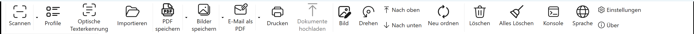

| Schaltfläche | Was sie tut |
| --- | --- |
| **Scannen** | Startet einen Scan mit dem gewählten Profil. Der kleine Pfeil daneben öffnet die Profilliste. |
| **Profile** | Öffnet die Profilverwaltung (anlegen, bearbeiten, löschen, importieren, exportieren). |
| **Optische Texterkennung** | Richtet die Texterkennung (OCR) ein, mit der PDFs durchsuchbar werden. |
| **Importieren** | Holt vorhandene PDF- oder Bilddateien ins Fenster. |
| **PDF speichern** | Speichert Seiten als PDF – unabhängig von der automatischen Ablage. |
| **Bilder speichern** | Speichert Seiten als JPEG, PNG oder TIFF. |
| **E-Mail als PDF** | Hängt die Seiten als PDF an eine neue E-Mail. |
| **Drucken** | Druckt die ausgewählten Seiten. |
| **Dokumente hochladen** | Lädt alle wartenden Dokumente hoch. Nur nötig bei Profilen, die manuell hochladen. |
| **Bild** | Bildbearbeitung für die ausgewählten Seiten (Kapitel 7). |
| **Drehen** | Links, rechts, um 180°, Schräglagenkorrektur, benutzerdefinierte Rotation. |
| **Nach oben / Nach unten** | Verschiebt die ausgewählten Seiten in der Reihenfolge. |
| **Neu ordnen** | Fächern, umkehren – für beidseitig gescannte Stapel. |
| **Löschen** | Löscht die ausgewählten Seiten aus dem Fenster. |
| **Alles Löschen** | Leert das Fenster. Auf der Platte wird nichts gelöscht. |
| **Konsole** | Öffnet das Protokollfenster (Kapitel 9). |
| **Sprache** | Stellt die Sprache der Oberfläche um. |
| **Einstellungen / Über** | Programmeinstellungen und Versionsinformationen. |

## 3.2 Die Scan-Einstellungen links

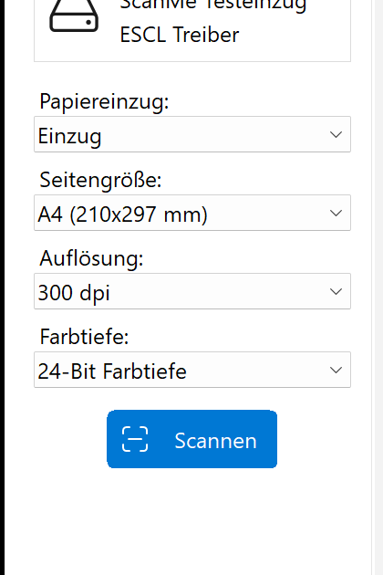

Hier wählen Sie das **Profil** und sehen sofort, womit gescannt wird: Gerät, Papiereinzug, Seitengröße,
Auflösung und Farbtiefe. Änderungen an diesen Feldern gelten für den nächsten Scan.

Die beiden kleinen Schaltflächen neben **Profil:** bearbeiten das gewählte Profil (Stift) beziehungsweise
legen ein neues an (Plus).

> **Tipp:** Wenn die Liste leer ist oder das richtige Profil fehlt, wenden Sie sich an die Person, die
> ScanMe eingerichtet hat. Ein Profil entscheidet über Ordner, Dateinamen und Archiv – ein selbst
> angelegtes Profil legt woanders ab.

Die Seitenleiste lässt sich mit der Schaltfläche unten links ausblenden, wenn Sie mehr Platz für die
Seiten brauchen.

## 3.3 Die Seiten in der Mitte

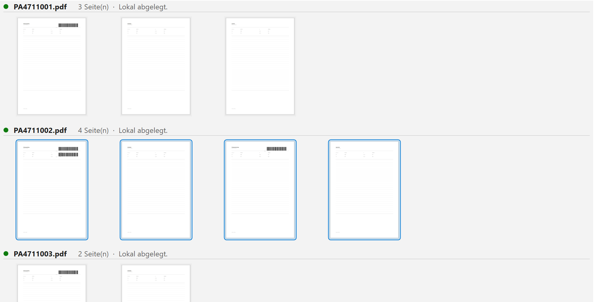

Die gescannten Seiten sind **nach Dokument gruppiert**. Über jeder Gruppe steht

* der **Dateiname**, unter dem das Dokument abgelegt wird oder wurde,
* die **Seitenzahl**,
* der **Status** („Lokal abgelegt.", „Wartet auf den Upload.", …),
* und ein farbiger Punkt: grün für erledigt, gelb für wartend, rot für einen Fehler.

Seiten, die zu keinem Dokument gehören – zum Beispiel importierte Dateien –, stehen unter der Überschrift
**Zu keinem Dokument**.

Schalten Sie unter **Einstellungen** die Option **Zeige Seitenzahlen** ein, erscheint unter jedem
Miniaturbild eine Nummer. Sie zählt **innerhalb des Dokuments** (`2 / 4`), nicht über den ganzen Stapel –
die Frage beim Prüfen lautet ja: Welche Seite *dieses* Dokuments ist das?

Unten links sitzen vier Schaltflächen: **Seitenleiste** ein-/ausblenden, **Dokumentenliste**
ein-/ausblenden, **Verkleinern** und **Vergrößern**.

## 3.4 Der Dokumentenbereich rechts

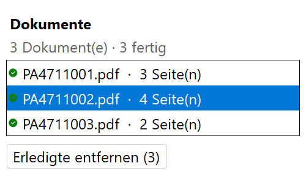

Oben steht die Zusammenfassung – `3 Dokument(e) · 3 fertig` – und darunter jedes Dokument der laufenden
Sitzung mit Namen, Seitenzahl und Statuspunkt.

**Erledigte Dokumente bleiben stehen.** Sie sind der Beleg dafür, dass diese Seiten durchgelaufen sind.
Am Ende eines Stapels räumt **Erledigte entfernen** die Liste auf und nimmt die zugehörigen Seiten aus
dem Fenster mit. Auf der Platte und im Archiv wird dabei nichts gelöscht.

Ein Klick auf ein Dokument wählt seine Seiten in der Mitte aus – und umgekehrt: Wenn Sie Seiten
markieren, die alle zu einem Dokument gehören, springt der Inspektor auf dieses Dokument.

<!-- pagebreak -->

# 4. Ein Scan von Anfang bis Ende

## Schritt 1 – Papier vorbereiten

* **Klammern und Heftungen entfernen.** Sie blockieren den Einzug.
* **Das Blatt mit dem Barcode nach vorn.** Es ist das Deckblatt des Dokuments und entscheidet, wie die
  Datei heißen wird.
* **Mehrere Vorgänge dürfen in einem Stapel liegen.** ScanMe trennt dort, wo sich der Barcode-Wert
  ändert – ein Stapel mit fünf Aufträgen ergibt fünf Dateien.
* **Barcodes müssen sauber gedruckt sein.** Ein zerknitterter, verschmierter oder überklebter Barcode
  wird nicht gelesen; das Dokument landet dann beim vorherigen.

## Schritt 2 – Profil wählen

Links unter **Profil:** das passende Profil auswählen. Darunter steht sofort, welches Gerät und welche
Auflösung dazugehören.

## Schritt 3 – Scannen

Auf **Scannen** klicken – entweder auf die große blaue Schaltfläche links unten oder auf **Scannen** in
der Symbolleiste. `Strg`+`Eingabe` tut dasselbe.

Die Seiten erscheinen einzeln im Fenster, während sie eingezogen werden. Sobald der letzte Bogen durch
ist, teilt ScanMe den Stapel in Dokumente auf, legt sie ab und – wenn das Profil das vorsieht – lädt sie
hoch. Über jeder Gruppe erscheint dabei der Dateiname.

## Schritt 4 – Prüfen

Das ist der wichtigste Schritt, und er dauert wenige Sekunden:

1. **Stimmt die Anzahl der Dokumente?** Rechts oben steht `n Dokument(e)`. Vergleichen Sie sie mit der
   Anzahl der Vorgänge im Stapel.
2. **Stimmen die Namen?** Über jeder Gruppe steht der Dateiname. Er sollte die Auftragsnummer vom
   Deckblatt tragen.
3. **Stimmen die Seitenzahlen?** Ein Dokument mit einer Seite mehr oder weniger als erwartet deutet auf
   eine übersehene oder falsch gelesene Trennung hin.

Falls etwas nicht passt: Kapitel 5 (Kennzeichnung korrigieren) und Kapitel 6 (falsch getrennt).

## Schritt 5 – Hochladen

Bei Profilen, die **automatisch** hochladen, ist an dieser Stelle schon alles passiert; die Dokumente
stehen auf grün.

Bei Profilen, die **manuell** hochladen, warten die Dokumente – der Status lautet dann „Lokal abgelegt,
wartet auf den Upload." Ein Klick auf **Dokumente hochladen** schickt alle wartenden Dokumente los. Ein
einzelnes Dokument laden Sie über die Schaltfläche **Hochladen** im Inspektor hoch.

## Schritt 6 – Aufräumen

**Erledigte entfernen** leert die Liste und das Fenster für den nächsten Stapel. Was abgelegt und
archiviert ist, bleibt abgelegt und archiviert.

<!-- pagebreak -->

# 5. Dokumente prüfen und korrigieren

Klicken Sie rechts auf ein Dokument – darunter erscheint der Inspektor mit allem, was zu diesem Dokument
gehört.

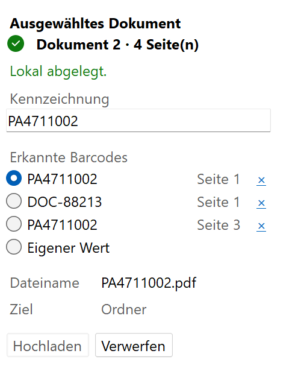

| Feld | Bedeutung |
| --- | --- |
| **Dokument n · m Seite(n)** | Position im Stapel und Umfang. Daneben der Statuspunkt. |
| *Statuszeile* | Was mit dem Dokument zuletzt passiert ist – siehe Tabelle unten. |
| **Kennzeichnung** | Der Wert, unter dem das Dokument abgelegt wird. Hier direkt änderbar. |
| **Erkannte Barcodes** | Alle Barcodes, die auf den Seiten dieses Dokuments gefunden wurden, mit Seitenangabe. Der ausgewählte ist die Kennzeichnung. |
| **Eigener Wert** | Auswählen, um eine Kennzeichnung von Hand einzutippen. |
| **Dateiname** | Wie die Datei heißt beziehungsweise heißen wird. |
| **Ziel** | Wohin das Dokument geht: Ordner, SharePoint, SAP – oder „bleibt im Fenster". |
| **Hochladen** / **Erneut versuchen** | Schickt genau dieses Dokument los. |
| **Verwerfen** | Nimmt das Dokument aus der Liste. Bereits abgelegte Dateien bleiben erhalten. |

## 5.1 Die Statusmeldungen

| Statuszeile | Bedeutung |
| --- | --- |
| **Wird verarbeitet…** | Das Dokument wird gerade geschrieben oder hochgeladen. Bitte nicht bearbeiten. |
| **Lokal abgelegt.** | Als PDF im Ordner des Profils. Das Profil kennt kein Archiv, also ist es fertig. |
| **Lokal abgelegt, wartet auf den Upload.** | Die Datei liegt im Ordner; der Upload wartet auf die Schaltfläche. |
| **Wartet auf den Upload.** | Wie oben, aber ohne lokale Kopie. |
| **Hochgeladen nach …** | Im Archiv angekommen. |
| **Abgeschlossen.** | Alles erledigt, was für dieses Profil vorgesehen war. |
| **Noch keine Kennzeichnung, das Dokument wird zurückgehalten.** | Es wurde kein Barcode gefunden, und das Profil verbietet die Ablage ohne Kennzeichnung. Tragen Sie einen Wert ein. |
| **Lokal abgelegt. Die Datei auf der Platte ist nicht mehr aktuell.** | Sie haben das Dokument nach dem Ablegen geändert. Ein Klick auf **Hochladen** schreibt die korrigierte Fassung. |
| **Es ist ein Fehler aufgetreten.** | Etwas ist schiefgegangen; der Grund steht in der Konsole. Das Dokument bleibt in der Liste, **Erneut versuchen** wiederholt den Versuch. |

## 5.2 Die Kennzeichnung korrigieren

Der häufigste Fall: Auf dem Deckblatt stehen mehrere Barcodes, und ScanMe hat den falschen genommen –
oder es wurde gar keiner erkannt.

**Ein erkannter Barcode ist der richtige:** Wählen Sie ihn unter **Erkannte Barcodes** aus. Der
Dateiname, die Überschrift über den Seiten und der Eintrag in der Liste ändern sich sofort mit.

**Kein Barcode passt:** Wählen Sie **Eigener Wert** und tippen Sie die Nummer ein. Die Eingabe wirkt
sich mit jedem Tastendruck aus – Sie sehen also direkt, wie die Datei heißen wird.

**Ein Barcode gehört gar nicht dazu:** Das kleine **×** neben einem Eintrag nimmt ihn aus dem Dokument.

> **Wichtig:** Korrigieren Sie **vor** dem Hochladen. Eine Korrektur nach dem Ablegen ist zwar möglich –
> das Dokument geht dann in die Warteschlange zurück – aber ScanMe schreibt die korrigierte Fassung
> **neben** die alte Datei, statt sie zu überschreiben. Eine Datei in Ihrem eigenen Ordner gehört Ihnen;
> ScanMe löscht sie nicht. Die alte Datei müssen Sie dann selbst entfernen.

## 5.3 Ein Dokument ohne Kennzeichnung

Wenn im Profil **Dokument ohne Kennzeichnung nicht ablegen** gesetzt ist, wird ein Dokument ohne
erkannten Barcode nicht abgelegt, sondern zurückgehalten. Das ist Absicht: Ein falsch benanntes Dokument
im Archiv findet niemand wieder.

**Dokumente hochladen** lädt in diesem Fall die übrigen Dokumente hoch und meldet, wie viele
zurückgehalten wurden. Tragen Sie die Kennzeichnung nach und klicken Sie noch einmal.

<!-- pagebreak -->

# 6. Wenn falsch getrennt wurde

Ein übersehenes Deckblatt macht aus zwei Dokumenten eines; ein Barcode, der nicht hätte trennen sollen,
macht aus einem Dokument zwei. Beides lässt sich im Fenster reparieren – **bevor** hochgeladen wird.

## 6.1 Dokument trennen oder zusammenfassen

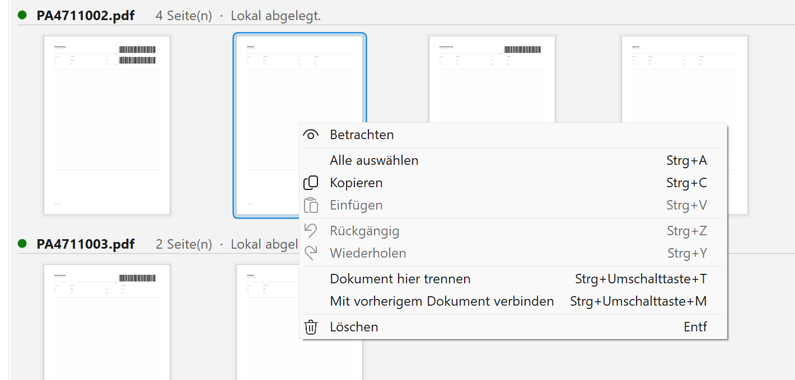

Rechtsklick auf eine Seite öffnet das Kontextmenü:

* **Dokument hier trennen** (`Strg`+`Umschalt`+`T`) macht die markierte Seite zur **ersten Seite eines
  neuen Dokuments**. Alles ab dieser Seite bis zum Ende des bisherigen Dokuments wandert mit.
* **Mit vorherigem Dokument verbinden** (`Strg`+`Umschalt`+`M`) hängt das Dokument an das direkt darüber
  liegende an.

**Die Kennzeichnung folgt den Seiten.** Nach dem Trennen bekommt jede Hälfte die Barcodes, die auf ihren
eigenen Seiten stehen: Die Hälfte mit dem Deckblatt behält die Auftragsnummer, die andere hört auf, einen
Barcode zu beanspruchen, der mit der ersten Hälfte gegangen ist. Ein von Hand eingetippter Wert bleibt
dabei erhalten.

Nicht angeboten wird:

* Trennen an der **ersten** Seite eines Dokuments – das ergäbe nichts.
* Trennen oder Verbinden bei einem Dokument, das bereits **im Archiv** liegt.
* Verbinden über **Profilgrenzen** hinweg.

## 6.2 Eine einzelne Seite in ein anderes Dokument ziehen

Manchmal ist nur ein Blatt beim falschen Vorgang gelandet. Ziehen Sie es einfach dorthin, wo es hingehört.

Beim Ablegen entscheidet **die Seite, über der der Mauszeiger steht** – nicht die Einfügemarke:

* Auf der **linken Hälfte** einer Seite ablegen → die gezogenen Seiten kommen in **deren** Dokument.
* Auf der **rechten Hälfte** der Seite darüber ablegen → sie kommen in das Dokument **darüber**. So
  hängen Sie auch zwei ganze Dokumente aneinander.
* Auf eine **Überschrift** ablegen → die Seiten kommen an den Anfang dieses Dokuments.

Der blaue Balken beim Ziehen wird innerhalb der Gruppe gezeichnet, in der die Seiten landen werden – wo
der Balken ist, kommen die Seiten hin.

## 6.3 Was ScanMe verweigert

Zwei Bearbeitungen lehnt ScanMe ab und sagt das auch – als Meldung im Fenster und als Zeile in der
Konsole:

**Die Seiten eines archivierten Dokuments lassen sich nicht löschen oder verschieben.** Sie sind der
Beleg dafür, dass genau diese Seiten im Archiv liegen. Eine Änderung, die im Fenster funktioniert, während
das Archiv unverändert bleibt, wäre schlimmer als eine, die verweigert wird. Betroffen sind nur Dokumente,
die tatsächlich in einem **Archiv** angekommen sind – ein Profil, das nur in einen Ordner ablegt, lässt
Korrekturen weiterhin zu.

**Seiten wandern nicht zwischen Dokumenten verschiedener Profile.** Das Profil entscheidet über Ordner,
Namen und Archiv – ein einziges Ziehen würde alle drei ändern, ohne dass etwas auf dem Bildschirm das
sagt.

Ein Dokument, das gerade geschrieben oder hochgeladen wird, bleibt ebenfalls unangetastet, bis es fertig
ist.

> **Hinweis:** **Alles Löschen** gilt nicht als Bearbeitung und wird deshalb nicht verweigert – so
> beginnt der nächste Stapel. Ein erledigtes Dokument behält seinen Eintrag ohnehin.

<!-- pagebreak -->

# 7. Seiten bearbeiten

Alles, was Sie hier an einer Seite ändern, **landet auch in der archivierten Datei** – solange das
Dokument noch nicht im Archiv ist. Eine schief eingezogene Seite muss also nicht neu gescannt werden.

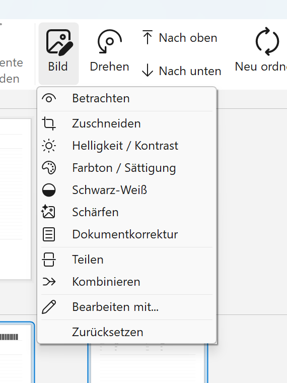

| Menüpunkt | Was er tut |
| --- | --- |
| **Betrachten** | Öffnet die Seite groß, zum Prüfen. |
| **Zuschneiden** | Schneidet Ränder ab. |
| **Helligkeit / Kontrast** | Hellt zu dunkle Scans auf oder verstärkt blasse Vorlagen. |
| **Farbton / Sättigung** | Farbkorrektur. |
| **Schwarz-Weiß** | Wandelt in reines Schwarz-Weiß um – ergibt kleinere Dateien bei reinem Text. |
| **Schärfen** | Macht unscharfe Kanten deutlicher. |
| **Dokumentkorrektur** | Richtet die Seite automatisch aus und bereinigt den Hintergrund. Meist der einzige Punkt, den man braucht. |
| **Teilen** | Zerlegt ein Bild in zwei Seiten – für Doppelseiten, die als ein Blatt gescannt wurden. |
| **Kombinieren** | Fügt zwei Seiten zu einer zusammen. |
| **Bearbeiten mit…** | Öffnet die Seite in einem externen Programm. |
| **Zurücksetzen** | Nimmt alle Bearbeitungen dieser Seite zurück. |

**Drehen** in der Symbolleiste enthält **Links drehen**, **Rechts drehen**, **um 180° drehen**,
**Schräglagenkorrektur** und **Benutzerdefinierte Rotation**. `Strg`+`Umschalt`+`Links` beziehungsweise
`Rechts` drehen ohne Umweg über das Menü.

**Reihenfolge ändern:** **Nach oben** und **Nach unten** verschieben markierte Seiten. **Neu ordnen**
enthält **Ineinander-Fächern** und **Auseinander-Fächern** – dafür gedacht, wenn Vorder- und Rückseiten
in zwei Durchgängen gescannt wurden – sowie **Umkehren**.

**Rückgängig** (`Strg`+`Z`) und **Wiederholen** (`Strg`+`Y`) gelten auch für diese Änderungen.

> **Tipp:** Markieren Sie mehrere Seiten mit `Strg`+Klick oder `Umschalt`+Klick und wenden Sie die
> Korrektur auf alle gleichzeitig an. `Strg`+`A` markiert alle Seiten.

<!-- pagebreak -->

# 8. Speichern, Drucken, E-Mail, Importieren

Die automatische Ablage aus dem Profil und das Speichern von Hand sind zwei verschiedene Dinge. Die
Schaltflächen in diesem Kapitel legen **zusätzliche** Kopien an, wo Sie sie haben wollen; am Archiv
ändern sie nichts.

| Schaltfläche | Wirkung |
| --- | --- |
| **PDF speichern** | Speichert die Seiten als PDF an einen Ort Ihrer Wahl. Der Pfeil daneben unterscheidet **Alles speichern** und **Auswahl speichern** und öffnet die PDF-Einstellungen (Kompression, Metadaten, Verschlüsselung, PDF/A). |
| **Bilder speichern** | Dasselbe als JPEG, PNG oder TIFF. |
| **E-Mail als PDF** | Erzeugt eine neue E-Mail mit den Seiten als PDF im Anhang. |
| **Drucken** | Druckt die ausgewählten Seiten. |
| **Importieren** | Holt vorhandene PDFs oder Bilder ins Fenster. |

**Importierte Seiten gehören zu keinem Dokument.** Sie erscheinen unter der Überschrift *Zu keinem
Dokument* und werden weder abgelegt noch hochgeladen. Ziehen Sie sie in ein Dokument (Kapitel 6.2), wenn
sie dorthin gehören.

**Texterkennung (OCR):** Ist sie eingeschaltet, werden gespeicherte PDFs durchsuchbar – der Text liegt
unsichtbar hinter dem Bild, sodass sich Dokumente später über ihren Inhalt finden lassen.

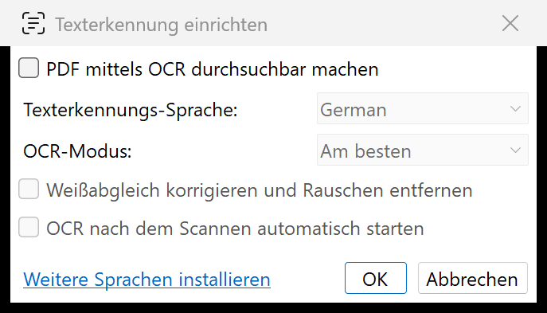

**PDF mittels OCR durchsuchbar machen** schaltet die Erkennung ein. Darunter wählen Sie die
**Texterkennungs-Sprache** – fehlende Sprachen holt **Weitere Sprachen installieren** nach – und den
**OCR-Modus**. **Weißabgleich korrigieren und Rauschen entfernen** hilft bei schlechten Vorlagen, kostet
aber zusätzliche Zeit, und **OCR nach dem Scannen automatisch starten** erspart den Aufruf von Hand.

> **Hinweis:** OCR ist rechenintensiv. Bei großen Stapeln dauert das Speichern spürbar länger.

<!-- pagebreak -->

# 9. Die Konsole

Die Konsole ist das nützlichste Werkzeug, wenn etwas nicht so läuft wie erwartet. Sie protokolliert
**jeden Schritt** eines Scans – ausdrücklich auch die Schritte, die bewusst nichts tun.

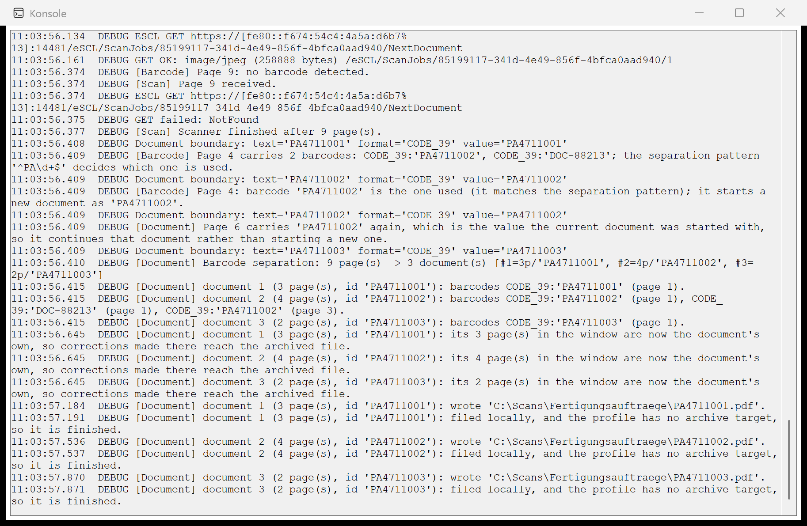

Jede Zeile beginnt mit der Uhrzeit und einer Kategorie in eckigen Klammern:

| Kategorie | Worum es geht |
| --- | --- |
| `[Scan]` | Seiten, die vom Scanner kommen |
| `[Barcode]` | Was auf einer Seite gefunden wurde – und was nicht |
| `[Document]` | Trennung, Kennzeichnung, geschriebene Dateien |
| `[Upload]` | SharePoint und SAP, mit Größen, Zeiten und Fehlern |
| `[Profile]` | Was das Profil vorgibt und was daraus folgt |
| `[App]` | Programmstart, Version |

Ein typischer Ausschnitt beantwortet genau die Frage, die man sich beim Prüfen stellt:

```
[Barcode] Page 4 carries 2 barcodes: CODE_39:'PA4711002', CODE_39:'DOC-88213';
          the separation pattern '^PA\d+$' decides which one is used.
[Barcode] Page 4: barcode 'PA4711002' is the one used (it matches the separation
          pattern); it starts a new document as 'PA4711002'.
[Document] Page 6 carries 'PA4711002' again, which is the value the current
          document was started with, so it continues that document rather than
          starting a new one.
[Document] Barcode separation: 9 page(s) -> 3 document(s)
```

Die Konsole steht immer offen zur Verfügung und schreibt nichts auf die Platte. Sie können den Inhalt
markieren und mit `Strg`+`C` kopieren – **genau das gehört in eine Support-Anfrage**, zusammen mit der
Angabe, welcher Stapel gescannt wurde und was Sie erwartet hätten.

> **Wenn ein Barcode nicht gefunden wurde**, steht in der Konsole, welcher **Suchbereich** aktiv war und
> welche **Barcode-Typen** gesucht wurden. Das sind die zwei häufigsten Ursachen, und beide sind im
> Profil einstellbar (Anhang A).

<!-- pagebreak -->

# 10. Einstellungen

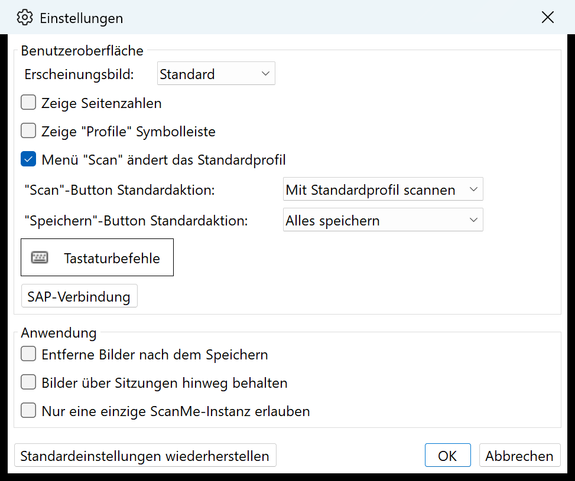

Die Einstellungen gelten für das Programm, nicht für ein einzelnes Profil.

**Benutzeroberfläche**

| Einstellung | Bedeutung |
| --- | --- |
| **Erscheinungsbild** | Hell, dunkel oder wie in Windows eingestellt. |
| **Zeige Seitenzahlen** | Blendet unter jedem Miniaturbild die Seitennummer ein (siehe Kapitel 3.3). |
| **Zeige „Profile" Symbolleiste** | Blendet eine zusätzliche Leiste mit allen Profilen ein. |
| **Menü „Scan" ändert das Standardprofil** | Ein über den Pfeil gewähltes Profil bleibt danach das voreingestellte. |
| **„Scan"-Button Standardaktion** / **„Speichern"-Button Standardaktion** | Was ein Klick auf die Schaltfläche selbst – ohne den Pfeil – auslöst. |
| **Tastaturbefehle** | Öffnet die Liste aller Tastenkombinationen zum Ändern (Kapitel 12). |
| **SAP-Verbindung** | Zugangsdaten und die beiden Zeitlimits für das SAP-Archiv (Anhang A.5). |

**Anwendung**

| Einstellung | Bedeutung |
| --- | --- |
| **Entferne Bilder nach dem Speichern** | Leert das Fenster nach einem Speichervorgang. |
| **Bilder über Sitzungen hinweg behalten** | Beim nächsten Start sind die Seiten wieder da. |
| **Nur eine einzige ScanMe-Instanz erlauben** | Verhindert, dass ScanMe versehentlich mehrfach läuft. |

**Standardeinstellungen wiederherstellen** setzt alles auf den Auslieferungszustand zurück – die Profile
bleiben davon unberührt.

Die Einstellungen für **PDF**, **Bilder** und **E-Mail** liegen nicht hier, sondern hinter dem kleinen
Pfeil neben der jeweiligen Schaltfläche in der Symbolleiste.

**Die Sprache** stellen Sie über die Schaltfläche **Sprache** in der Symbolleiste um. ScanMe baut das
Fenster daraufhin neu auf; die gescannten Seiten bleiben erhalten.

<!-- pagebreak -->

# 11. Wenn etwas nicht klappt

| Beobachtung | Wahrscheinliche Ursache | Was zu tun ist |
| --- | --- | --- |
| **Der ganze Stapel wurde ein einziges Dokument.** | Kein Barcode wurde erkannt. | Konsole öffnen: Steht dort „no barcode detected"? Dann prüfen, ob das Deckblatt sauber gedruckt ist, ob der richtige **Barcode-Typ** im Profil aktiv ist und ob ein **Suchbereich** eingestellt ist, der den Barcode ausschließt. |
| **Zu viele Dokumente – jedes Deckblatt hat eines begonnen.** | Im Profil fehlt **Neues Dokument nur bei Wechsel des Barcode-Werts**. | Dokumente mit **Mit vorherigem Dokument verbinden** zusammenfassen, danach das Profil korrigieren lassen. |
| **Ein Dokument hat eine Seite zu viel oder zu wenig.** | Ein Deckblatt wurde übersehen oder ein Barcode falsch gelesen. | Kapitel 6: trennen, verbinden oder die Seite ziehen. |
| **Der Dateiname enthält eine fremde Nummer.** | Auf dem Deckblatt stehen mehrere Barcodes. | Im Inspektor den richtigen Barcode auswählen. Auf Dauer hilft ein **Trennmuster** im Profil. |
| **„Noch keine Kennzeichnung, das Dokument wird zurückgehalten."** | Kein Barcode gefunden, und das Profil verlangt eine Kennzeichnung. | **Eigener Wert** wählen und die Nummer eintippen. |
| **„Es ist ein Fehler aufgetreten."** | Der Upload ist gescheitert. | Konsole öffnen, die `[Upload]`-Zeilen lesen. Dann **Erneut versuchen**. Das Dokument bleibt so lange in der Liste – ein fehlgeschlagener Upload ist keine Sackgasse. |
| **Der Upload lief in eine Zeitüberschreitung.** | Verbindung zu langsam oder SAP antwortet nicht. | Die Konsole sagt, welche Seite langsam war: „still sending" heißt Leitung, „waiting" heißt SAP. **Achtung:** Ein Dokument, dessen Upload in eine Zeitüberschreitung lief, kann trotzdem im Archiv angekommen sein. Vor dem erneuten Versuch im Archiv nachsehen. |
| **Löschen oder Verschieben wird abgelehnt.** | Das Dokument liegt bereits im Archiv, oder die Seiten gehören zu verschiedenen Profilen. | Kapitel 6.3. Die Meldung nennt den Grund. |
| **Das Fenster wird immer voller.** | Erledigte Dokumente bleiben absichtlich stehen. | **Erledigte entfernen**. |
| **Die Datei im Ordner zeigt noch den alten Stand.** | Sie haben nach dem Ablegen korrigiert. | **Hochladen** klicken – die korrigierte Fassung wird geschrieben, **neben** die alte. Die alte Datei selbst entfernen. |
| **Der Scanner wird nicht gefunden.** | Gerät aus, Kabel ab oder Netzwerkscanner nicht erreichbar. | Gerät prüfen, dann im Profil unter **Gerät wählen** neu auswählen. |

**Was einer Support-Anfrage hilft:**

1. Der Inhalt der **Konsole** (markieren, `Strg`+`C`).
2. Welches **Profil** benutzt wurde.
3. Was Sie erwartet hatten und was stattdessen passiert ist.
4. Die **Version** – sie steht in **Über**, der unteren Hälfte der Schaltfläche rechts außen.

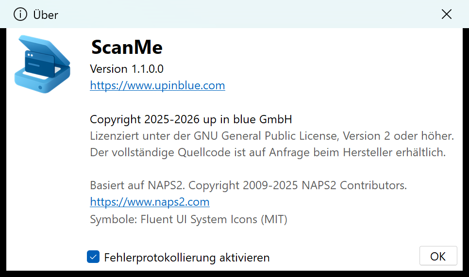

*Hier steht die Versionsnummer. **Fehlerprotokollierung aktivieren** schreibt zusätzlich eine
Protokolldatei mit (siehe Anhang C) – lassen Sie die Option eingeschaltet, wenn ein Fehler noch
untersucht wird.*

<!-- pagebreak -->

# 12. Tastaturbefehle

| Taste | Wirkung |
| --- | --- |
| `Strg`+`Eingabe` | Scannen |
| `F2` … `F12` | Mit dem 1. bis 11. Profil scannen |
| `Strg`+`N` | Neues Profil |
| `Strg`+`L` | Profilverwaltung |
| `Strg`+`O` | Importieren |
| `Strg`+`S` | Alles als PDF speichern |
| `Strg`+`Umschalt`+`S` | Auswahl als PDF speichern |
| `Strg`+`I` | Alles als Bilder speichern |
| `Strg`+`Umschalt`+`I` | Auswahl als Bilder speichern |
| `Strg`+`E` | Alles als E-Mail |
| `Strg`+`P` | Drucken |
| `Strg`+`A` | Alle Seiten auswählen |
| `Strg`+`C` / `Strg`+`V` | Kopieren / Einfügen |
| `Strg`+`Z` / `Strg`+`Y` | Rückgängig / Wiederholen |
| `Entf` | Ausgewählte Seiten löschen |
| `Strg`+`Umschalt`+`Entf` | Alles löschen |
| `Strg`+`Auf` / `Strg`+`Ab` | Seite nach oben / unten verschieben |
| `Strg`+`Umschalt`+`Links` / `Rechts` | Links / rechts drehen |
| `Strg`+`Umschalt`+`Ab` | Um 180° drehen |
| **`Strg`+`Umschalt`+`T`** | **Dokument hier trennen** |
| **`Strg`+`Umschalt`+`M`** | **Mit vorherigem Dokument verbinden** |
| `Strg`+`+` / `Strg`+`-` | Miniaturbilder vergrößern / verkleinern |
| `Strg`+`B` | Stapel-Scan |
| `F1` | Über ScanMe |

Die meisten dieser Tastenkombinationen lassen sich unter **Einstellungen → Tastaturbefehle** ändern.

<!-- pagebreak -->

# Anhang A – Profile einrichten

Ein **Profil** ist die vollständige Beschreibung eines wiederkehrenden Scanauftrags: welcher Scanner,
wie getrennt wird, wie die Datei heißt, wohin sie geht. Das ist die Einrichtung, die einmal gemacht wird
und danach für jeden Stapel gilt.

Dieser Anhang gibt einen Überblick. Die ausführliche Einrichtung – vor allem der SharePoint- und
SAP-Zugänge – gehört in die Hände der Person, die die Zugangsdaten verwaltet.

## A.1 Die Profilverwaltung

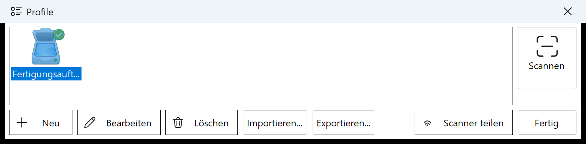

**Profile** in der Symbolleiste öffnet die Liste. **Neu**, **Bearbeiten** und **Löschen** sprechen für
sich.

**Importieren…** und **Exportieren…** bringen Profile auf einen zweiten Rechner. Exportiert wird die
Auswahl oder – wenn nichts ausgewählt ist – alles; importierte Profile werden angehängt und überschreiben
nie ein vorhandenes. **Weder das SAP-Kennwort noch das SharePoint-Client-Secret wandern mit**: Das
SAP-Kennwort ist an Benutzer und Rechner gebunden und anderswo ohnehin unbrauchbar, und das
Client-Secret läge sonst im Klartext in einer Datei, die jemand sich selbst per E-Mail schickt. Beides
muss auf dem Zielrechner neu eingegeben werden; ScanMe sagt beim Import, welche Profile davon betroffen
sind.

*Diese beiden Schaltflächen kamen nach Version 1.1.0.0 hinzu. In älteren Installationen fehlen sie.*

## A.2 Reiter „Scanner"

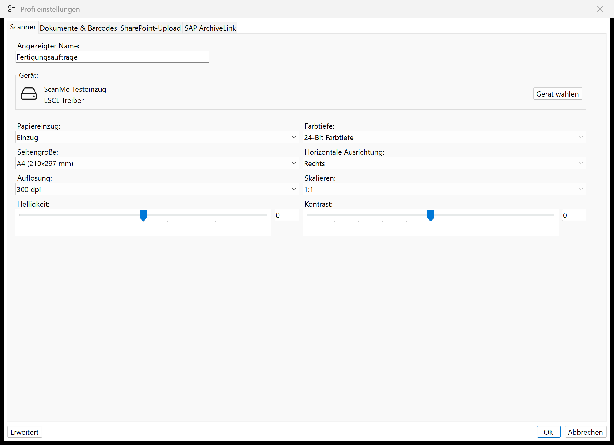

**Angezeigter Name** ist der Name, unter dem das Profil in der Liste erscheint. **Gerät wählen** listet
die angeschlossenen WIA- und TWAIN-Scanner sowie Netzwerkgeräte (ESCL). Darunter die
Aufnahmeeinstellungen: **Papiereinzug** (Flachbett oder Einzug, ein- oder beidseitig), **Seitengröße**,
**Auflösung**, **Farbtiefe**, **Horizontale Ausrichtung**, **Skalieren**, **Helligkeit** und
**Kontrast**. **Erweitert** unten links enthält Sonderfälle wie das Überspringen leerer Seiten.

> **Für Barcode-Trennung sind 300 dpi der sinnvolle Ausgangswert.** Weniger macht schmale Striche
> unlesbar, mehr kostet nur Zeit und Platz.

## A.3 Reiter „Dokumente & Barcodes"

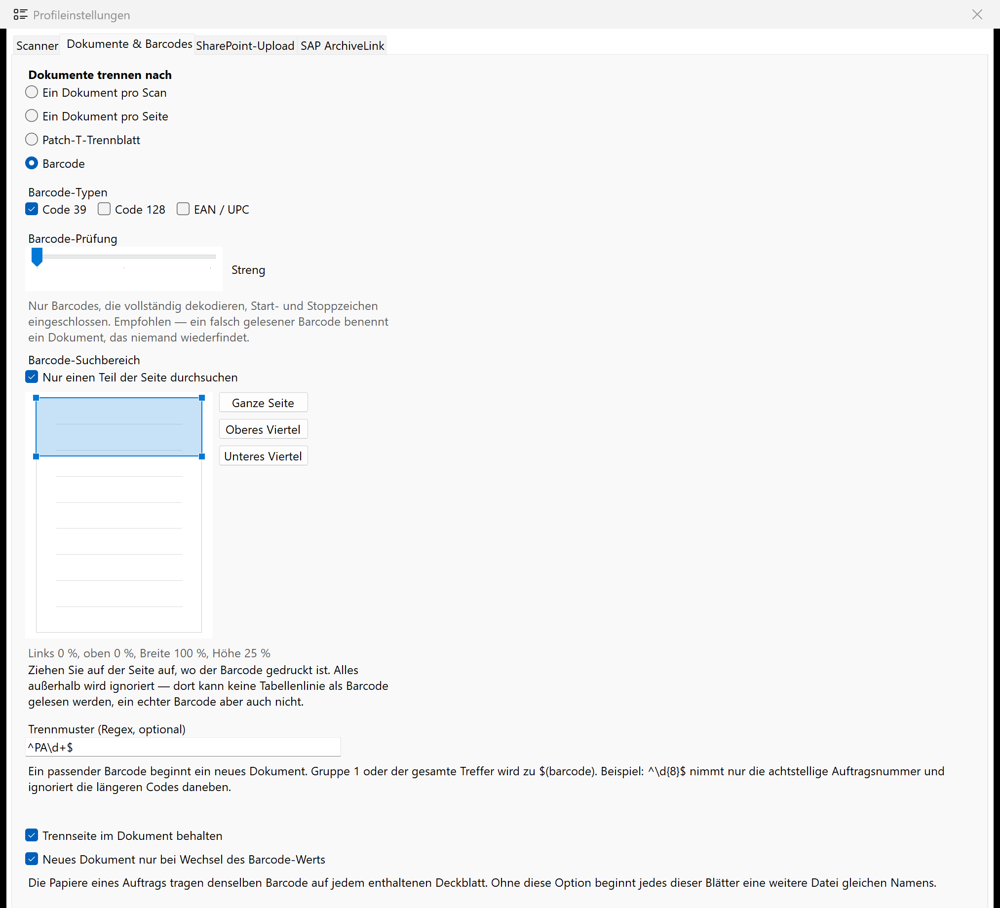

**Dokumente trennen nach** – wie aus dem Stapel Dokumente werden:

| Einstellung | Wirkung |
| --- | --- |
| **Ein Dokument pro Scan** | Der ganze Stapel wird eine Datei. |
| **Ein Dokument pro Seite** | Jede Seite wird eine Datei. |
| **Patch-T-Trennblatt** | Getrennt wird an eingelegten Patch-T-Karten. Die Karte selbst wird nie Teil des Dokuments – sie ist wiederverwendbar. |
| **Barcode** | Getrennt wird an den Barcodes auf den Deckblättern. |

**Barcode-Typen** – mindestens einer muss gesetzt sein. Ohne Einschränkung versucht ScanMe jedes
bekannte Format, und Tabellenlinien oder dichter Druck werden dann als Barcode gelesen, der gar nicht auf
dem Papier steht. **EAN / UPC ist dabei das riskanteste Format** – acht Ziffern ohne brauchbare
Selbstprüfung –, deshalb warnt der Dialog, wenn es aktiv ist.

**Barcode-Prüfung** – wie beschädigt ein gedruckter Barcode sein darf:

* **Streng** (Voreinstellung) nimmt nur Barcodes an, die vollständig dekodieren. Das ist die richtige
  Wahl, solange nichts dagegen spricht.
* **Tolerant** und **Sehr tolerant** akzeptieren zusätzlich Code-39-Barcodes mit fehlerhaft gedrucktem
  Stoppzeichen. Nur wählen, wenn nachweislich Codes übersehen werden. So angenommene Werte werden in der
  Konsole benannt.

**Barcode-Suchbereich** – der wirksamste Schutz gegen falsch gelesene Barcodes.

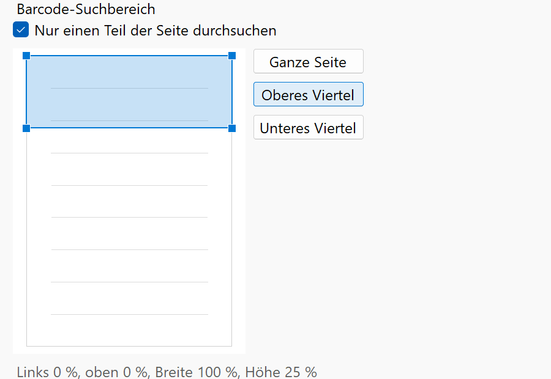

Wenn Ihre Unterlagen den Barcode immer an derselben Stelle tragen, ziehen Sie den Bereich auf der Seite
auf. Alles außerhalb wird ignoriert – dort kann keine Tabellenlinie als Barcode gelesen werden. Drei
Voreinstellungen (**Ganze Seite**, **Oberes Viertel**, **Unteres Viertel**) decken die üblichen Fälle ab.
Die Einstellung ist für bestehende Profile aus gutem Grund ausgeschaltet: Eine nachträglich eingeführte
Einschränkung würde ein funktionierendes Profil stillschweigend blind machen.

**Trennmuster (Regex, optional)** – wenn auf dem Deckblatt mehrere Barcodes stehen, entscheidet dieses
Muster, welcher gemeint ist. Beispiel: `^PA\d+$` nimmt nur Codes, die mit `PA` beginnen und sonst nur aus
Ziffern bestehen. Was in Klammern steht (Gruppe 1) beziehungsweise der ganze Treffer wird zur
Kennzeichnung.

**Trennseite im Dokument behalten** – ob das Deckblatt Teil des Dokuments bleibt. Bei Barcode-Trennung
meistens ja, denn es ist das Deckblatt des Vorgangs.

**Neues Dokument nur bei Wechsel des Barcode-Werts** – eingeschaltet lassen. Ohne diese Option beginnt
jedes weitere Deckblatt desselben Auftrags eine neue Datei gleichen Namens.

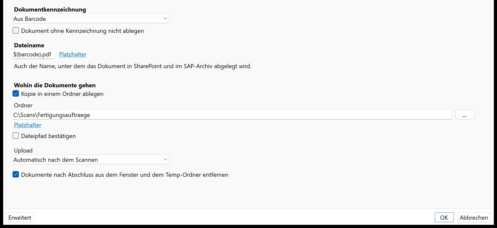

**Dokumentkennzeichnung** – woher die Kennzeichnung kommt: **Aus Barcode**, **Nach dem Scannen abfragen**
oder **Keine**. **Dokument ohne Kennzeichnung nicht ablegen** hält Dokumente zurück, statt sie unter
einem Behelfsnamen abzulegen.

**Dateiname** – der Name der Datei, und zugleich der Name in SharePoint und im SAP-Archiv. Über
**Platzhalter** stehen unter anderem zur Verfügung:

| Platzhalter | Ergibt |
| --- | --- |
| `$(barcode)` | Die Kennzeichnung des Dokuments – der Barcode, den das Trennmuster ausgewählt hat |
| `$(id)` | Ebenfalls die Kennzeichnung, einschließlich eines von Hand eingegebenen Werts |
| `$(barcode:2)` | Den zweiten Barcode auf dem Dokument |
| `$(barcode:type=QR)` | Den ersten Barcode eines bestimmten Typs |
| `$(YYYY)` `$(MM)` `$(DD)` | Jahr, Monat, Tag |
| `$(hh)` `$(mm)` `$(ss)` | Stunde, Minute, Sekunde |
| `$(n)` … `$(nnnn)` | Fortlaufende Nummer |
| `$(profile)` `$(user)` `$(host)` | Profilname, Benutzer, Rechner |

Ein typischer Wert ist `$(barcode).pdf`. Eine im Inspektor korrigierte Kennzeichnung wirkt sich auf beide
Platzhalter aus – der Dateiname folgt der Korrektur.

**Wohin die Dokumente gehen** – **Kopie in einem Ordner ablegen** samt Ordnerpfad (Platzhalter sind auch
hier erlaubt), **Dateipfad bestätigen** für ein Rückfragefenster bei jedem Scan, und **Upload**:
*Automatisch nach dem Scannen* oder *Manuell über Schaltfläche*.

Ablegen, Hochladen und der Auslöser sind **drei getrennte Einstellungen**. „Nichts lokal behalten, auf
Knopfdruck hochladen" ist deshalb eine Kombination, die man einfach auswählen kann.

**Dokumente nach Abschluss aus dem Fenster und dem Temp-Ordner entfernen** – räumt nach erfolgreichem
Archivieren automatisch auf.

## A.4 Reiter „SharePoint-Upload"

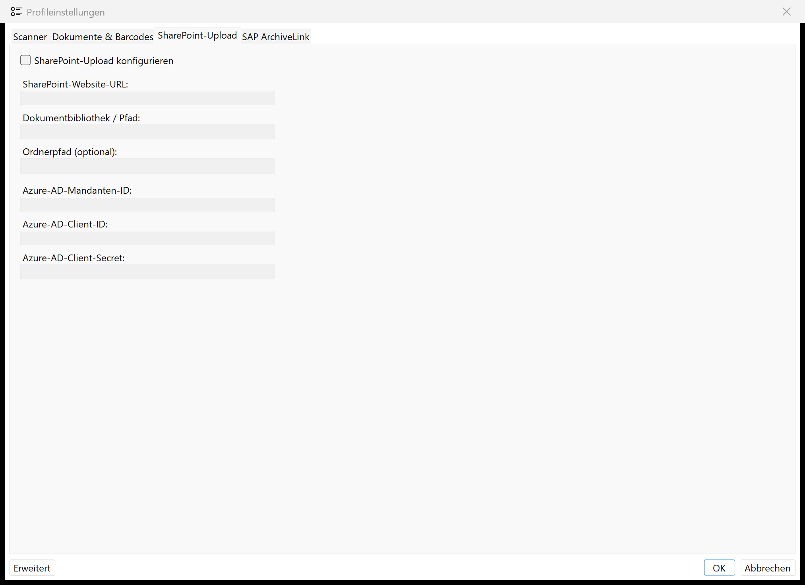

**SharePoint-Upload konfigurieren** schaltet den Upload ein. Darunter: **SharePoint-Website-URL**,
**Dokumentbibliothek / Pfad** und **Ordnerpfad (optional)** – im Ordnerpfad sind dieselben Platzhalter
erlaubt wie beim Dateinamen, `$(barcode)` also auch –, dazu die Zugangsdaten der in Azure registrierten
Anwendung: **Azure-AD-Mandanten-ID**, **Azure-AD-Client-ID** und **Azure-AD-Client-Secret**.

## A.5 Reiter „SAP ArchiveLink"

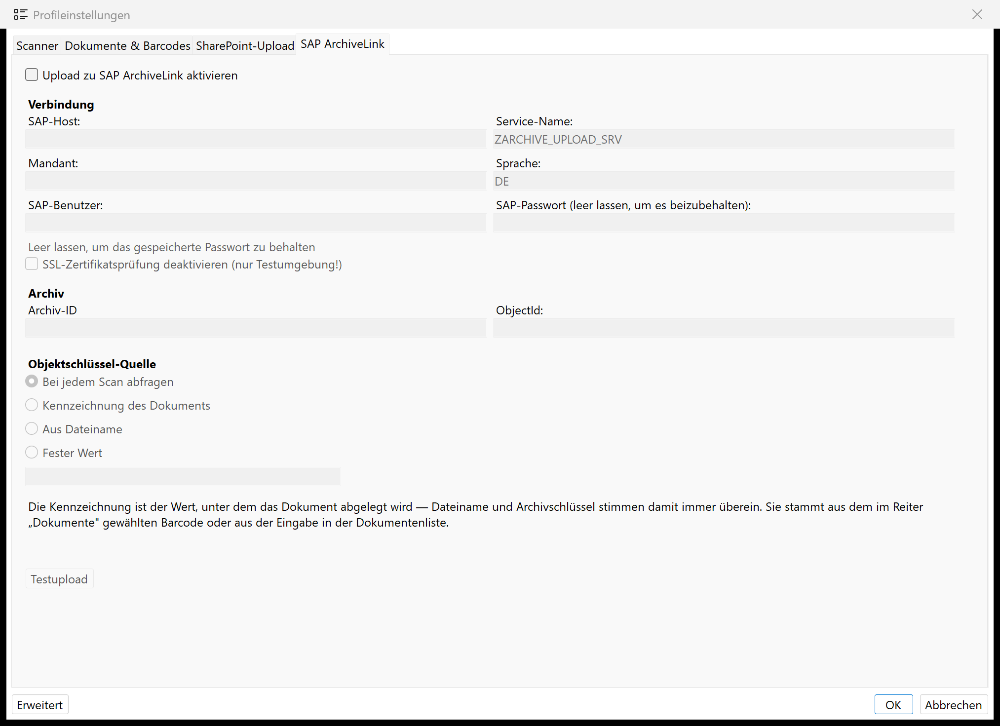

**Upload zu SAP ArchiveLink aktivieren** schaltet den Upload ein. Darunter:

* **Verbindung** – SAP-Host, Service-Name, Mandant, Sprache, SAP-Benutzer und SAP-Passwort. Das Feld für
  das Passwort bleibt beim Bearbeiten leer; ein leeres Feld behält das gespeicherte Passwort.
  **SSL-Zertifikatsprüfung deaktivieren** ist ausdrücklich nur für Testumgebungen gedacht.
* **Archiv** – **Archiv-ID** und **ObjectId**.
* **Objektschlüssel-Quelle** – woher der Schlüssel kommt, unter dem SAP das Dokument einem Vorgang
  zuordnet: **Kennzeichnung des Dokuments** (der Normalfall – Dateiname und Archivschlüssel stimmen dann
  immer überein), **Aus Dateiname**, **Fester Wert** oder **Bei jedem Scan abfragen**. Für die ersten
  beiden lässt sich ein Regex hinterlegen, der aus dem Wert nur einen Teil herausschneidet.

**Testupload** schickt eine ausgewählte PDF-Datei zur Probe ins Archiv – die schnellste Art
festzustellen, ob die Verbindung steht. Was dabei passiert, steht Zeile für Zeile in der Konsole.

Die **Zeitlimits** der Verbindung stehen unter **Einstellungen → SAP-Verbindung**: eines für die
Anmeldung (Standard 30 Sekunden) und eines für den Upload einschließlich der Archivierung (Standard 300
Sekunden). Beide werden bei jedem Upload in der Konsole genannt.

<!-- pagebreak -->

# Anhang B – Begriffe

**Barcode** – Der Strichcode auf dem Papier. ScanMe liest Code 39, Code 128 und EAN/UPC.

**Dokument** – Eine Gruppe zusammengehöriger Seiten, die als eine PDF-Datei abgelegt wird. Entsteht beim
Trennen des Stapels.

**Kennzeichnung** – Der Wert, unter dem ein Dokument abgelegt wird. Kommt normalerweise vom Barcode des
Deckblatts, kann aber von Hand geändert werden. Bestimmt gleichzeitig Dateinamen, SharePoint-Ordner und
SAP-Objektschlüssel.

**Patch-T** – Ein genormtes Trennblatt mit einem festen Balkenmuster. Wiederverwendbare Karte; wird nie
Teil eines Dokuments.

**Profil** – Die gespeicherte Beschreibung eines Scanauftrags: Gerät, Trennung, Dateiname, Ziel.

**Regex (regulärer Ausdruck)** – Ein Suchmuster für Text. In ScanMe entscheidet es, welcher von mehreren
Barcodes gemeint ist.

**ArchiveLink** – Die SAP-Schnittstelle, über die Dokumente ins SAP-Archiv gelangen.

**Objektschlüssel** – Der Schlüssel, unter dem SAP ein archiviertes Dokument einem Vorgang zuordnet.

**OCR / Texterkennung** – Wandelt das Bild eines Textes in durchsuchbaren Text um.

**Trennmuster** – Der reguläre Ausdruck, der entscheidet, welcher Barcode ein neues Dokument beginnt.

<!-- pagebreak -->

# Anhang C – Wo ScanMe seine Daten ablegt

| Was | Wo |
| --- | --- |
| Profile | `%APPDATA%\ScanMe\profiles.xml` |
| Programmeinstellungen | `%APPDATA%\ScanMe\config.xml` |
| Protokolldateien | `%APPDATA%\ScanMe\debuglog.txt`, `errorlog.txt` |
| Wiederherstellungsdaten | `%APPDATA%\ScanMe\recovery` |
| Zwischendateien | `%APPDATA%\ScanMe\temp` |
| Abgelegte Dokumente | In dem Ordner, den das jeweilige Profil vorgibt |

**Wiederherstellung nach einem Absturz:** Beim nächsten Start fragt ScanMe, ob die Seiten der letzten
Sitzung wiederhergestellt werden sollen. **Wiederherstellen** holt sie zurück, **Jetzt nicht** lässt sie
liegen (die Frage kommt beim nächsten Start wieder), **Löschen** verwirft sie endgültig.

---

<div align="center">

**ScanMe** · © 2025–2026 up in blue GmbH · [www.upinblue.com](https://www.upinblue.com)

ScanMe baut auf [NAPS2](https://www.naps2.com) auf.

</div>
