<div align="center">

# ScanMe

## User Manual

**Scan paper, split it into documents, file it and archive it**


Version 1.1 · August 2026

**up in blue GmbH**

</div>

<!-- pagebreak -->

## Contents

1. [About this manual](#1-about-this-manual)
2. [What ScanMe does](#2-what-scanme-does)
3. [The window](#3-the-window)
4. [A scan from start to finish](#4-a-scan-from-start-to-finish)
5. [Checking and correcting documents](#5-checking-and-correcting-documents)
6. [When the split went wrong](#6-when-the-split-went-wrong)
7. [Editing pages](#7-editing-pages)
8. [Saving, printing, email, importing](#8-saving-printing-email-importing)
9. [The console](#9-the-console)
10. [Settings](#10-settings)
11. [When something goes wrong](#11-when-something-goes-wrong)
12. [Keyboard shortcuts](#12-keyboard-shortcuts)
13. [Appendix A – Setting up profiles](#appendix-a--setting-up-profiles)
14. [Appendix B – Glossary](#appendix-b--glossary)
15. [Appendix C – Where ScanMe keeps its data](#appendix-c--where-scanme-keeps-its-data)

<!-- pagebreak -->

# 1. About this manual

This manual is for everyone who uses ScanMe to **scan and archive paper**. Chapters 2 to 12 describe the
daily work and assume somebody has already set the profiles up. If you set them up yourself, you will
find what you need in **Appendix A**.

**How to read it:**

* If this is your first time with ScanMe, read chapters 2 to 5. That is the complete workflow.
* If a stack was split in the wrong place, go straight to chapter 6.
* If something does not work, chapter 11 helps — and so does the **console** from chapter 9, which
  records what happened during every scan.

**Conventions used here**

| Style | Meaning |
| --- | --- |
| **Scan** | A button or a menu entry in ScanMe |
| `PA4711001.pdf` | A file name, a barcode value or something you type |
| `Ctrl`+`Shift`+`T` | A key combination |

> **Note:** Every example in this manual — order numbers, document names, folders and profile names — is
> made up. They come from a test run with a simulated scanner and show no real data.

<!-- pagebreak -->

# 2. What ScanMe does

ScanMe scans a **stack of paper** and turns it into **separate documents** — each one filed under the
value printed on its cover sheet.

A stack always takes the same path:

| Step | What happens |
| --- | --- |
| **1. Scan** | Every sheet is fed through and appears as a page in the window. |
| **2. Read barcodes** | Each page is searched for barcodes. |
| **3. Split** | Wherever a matching barcode turns up, a new document begins. |
| **4. Identify** | The barcode that separated the document becomes its **identification** — and with it, the file name. |
| **5. File** | The document is written as a PDF into the folder the profile names. |
| **6. Upload** | If the profile knows an archive, the same document goes to SharePoint and/or the SAP archive. |

What sets ScanMe apart from an ordinary scanning program:

**A document is a case, not a file.** As long as a document is in the window you can correct its
identification, rotate pages, drag a page into another document or merge two documents. The file is only
produced when the document is written — **from the state the document is in at that moment**. A
correction therefore reaches the file name, the SharePoint folder and the SAP object key together.

**The same barcode twice does not start a second document.** The papers of one order often carry the
order number on several cover sheets. Only when the value changes does a new document begin. Without that
rule you would get several files with the same name — afterwards indistinguishable from a stack scanned
twice.

**Nothing happens silently.** Every step writes a line into the console — including the steps that
deliberately do nothing ("Page 3: no barcode detected."). Exactly the cases where a program usually says
nothing are the ones you can read back here.

<!-- pagebreak -->

# 3. The window

The main window has four areas.


*The toolbar along the top, the scan configuration on the left, the pages in the middle, the documents on
the right.*

## 3.1 The toolbar

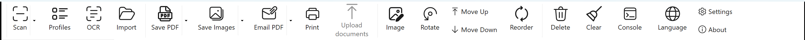

| Button | What it does |
| --- | --- |
| **Scan** | Starts a scan with the selected profile. The small arrow beside it opens the profile list. |
| **Profiles** | Opens profile management (create, edit, delete, import, export). |
| **OCR** | Sets up text recognition, which makes saved PDFs searchable. |
| **Import** | Brings existing PDF or image files into the window. |
| **Save PDF** | Saves pages as a PDF, independently of the automatic filing. |
| **Save Images** | Saves pages as JPEG, PNG or TIFF. |
| **Email PDF** | Attaches the pages to a new email as a PDF. |
| **Print** | Prints the selected pages. |
| **Upload documents** | Uploads every document that is waiting. Only needed for profiles that upload manually. |
| **Image** | Image editing for the selected pages (chapter 7). |
| **Rotate** | Left, right, 180°, deskew, custom rotation. |
| **Move Up / Move Down** | Moves the selected pages within the order. |
| **Reorder** | Interleave, deinterleave, reverse — for stacks scanned in two passes. |
| **Delete** | Deletes the selected pages from the window. |
| **Clear** | Empties the window. Nothing on disk is deleted. |
| **Console** | Opens the log window (chapter 9). |
| **Language** | Switches the language of the interface. |
| **Settings / About** | Program settings and version information. |

## 3.2 The scan configuration on the left

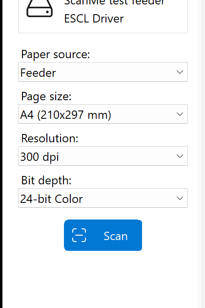

Here you pick the **profile** and see immediately what it scans with: device, paper source, page size,
resolution and bit depth. Changes to these fields apply to the next scan.

The two small buttons beside **Profile:** edit the selected profile (pencil) or create a new one (plus).

> **Tip:** If the list is empty or the right profile is missing, ask whoever set ScanMe up. A profile
> decides the folder, the file name and the archive — a profile you create yourself files somewhere else.

The sidebar can be hidden with the button at the bottom left when you need more room for the pages.

## 3.3 The pages in the middle

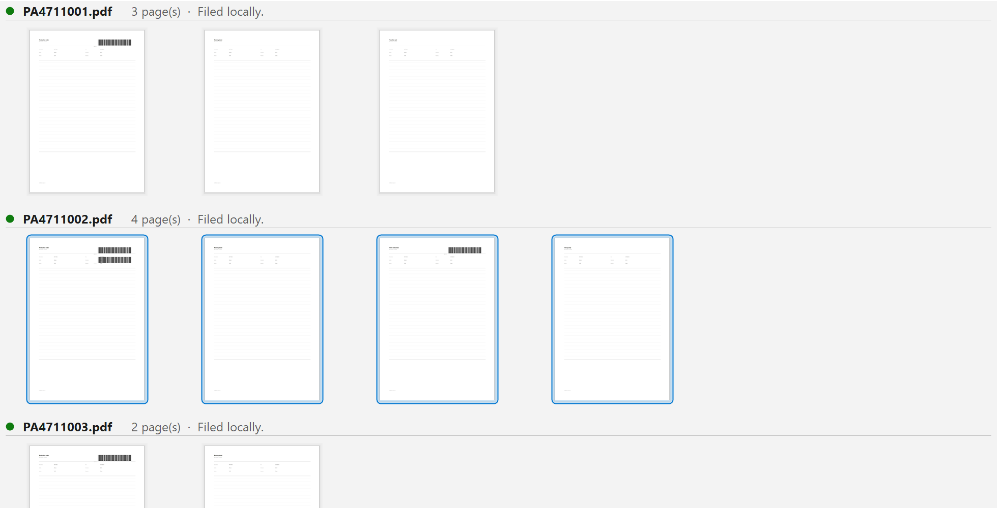

The scanned pages are **grouped by document**. Above each group you see

* the **file name** the document is filed as, or will be filed as,
* the **page count**,
* the **status** ("Filed locally.", "Waiting to be uploaded.", …),
* and a coloured dot: green for finished, amber for waiting, red for an error.

Pages that belong to no document — imported files, for instance — sit under the heading **Not part of a
document**.

Turn **Show page numbers** on under **Settings** and a number appears under each thumbnail. It counts
**within the document** (`2 / 4`), not across the whole batch — the question you ask while checking is,
after all: which page of *this* document is that?

Four buttons sit at the bottom left: show or hide the **sidebar**, show or hide the **document list**,
**Zoom Out** and **Zoom In**.

## 3.4 The document area on the right

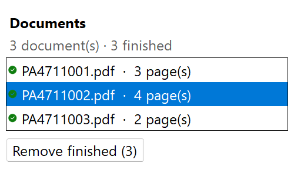

At the top is the summary — `3 document(s) · 3 finished` — and below it every document of the current
session with its name, page count and status dot.

**Finished documents stay in the list.** They are the record that those pages went through. At the end of
a stack, **Remove finished** clears the list and takes the pages out of the window with them. Nothing is
deleted from disk or from the archive.

Clicking a document selects its pages in the middle — and the other way round: select pages that all
belong to one document and the inspector jumps to that document.

<!-- pagebreak -->

# 4. A scan from start to finish

## Step 1 — Prepare the paper

* **Remove staples and clips.** They jam the feeder.
* **The sheet with the barcode goes first.** It is the document's cover sheet and decides what the file
  will be called.
* **Several cases may go in one stack.** ScanMe splits wherever the barcode value changes — a stack with
  five orders produces five files.
* **Barcodes have to be printed cleanly.** A creased, smudged or stickered-over barcode is not read, and
  the document then joins the one before it.

## Step 2 — Pick a profile

Choose the profile under **Profile:** on the left. Underneath you can see straight away which device and
which resolution belong to it.

## Step 3 — Scan

Click **Scan** — either the large blue button at the bottom left or **Scan** in the toolbar.
`Ctrl`+`Enter` does the same.

The pages appear one by one as they are fed through. As soon as the last sheet is done, ScanMe splits the
stack into documents, files them and — if the profile says so — uploads them. The file name appears above
each group as it goes.

## Step 4 — Check

This is the most important step, and it takes a few seconds:

1. **Is the number of documents right?** The top right says `n document(s)`. Compare it with the number
   of cases in the stack.
2. **Are the names right?** The file name is above each group. It should carry the order number from the
   cover sheet.
3. **Are the page counts right?** A document with one page more or fewer than expected points at a missed
   or misread separation.

If something is off: chapter 5 (correcting the identification) and chapter 6 (split in the wrong place).

## Step 5 — Upload

With profiles that upload **automatically**, everything has already happened by this point; the documents
are green.

With profiles that upload **manually**, the documents wait — the status then reads "Filed locally,
waiting to be uploaded." One click on **Upload documents** sends all waiting documents off. A single
document goes up via the **Upload** button in the inspector.

## Step 6 — Clean up

**Remove finished** clears the list and the window for the next stack. What has been filed and archived
stays filed and archived.

<!-- pagebreak -->

# 5. Checking and correcting documents

Click a document on the right — the inspector below it shows everything about that document.

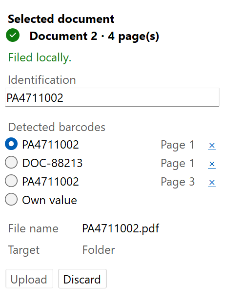

| Field | Meaning |
| --- | --- |
| **Document n · m page(s)** | Position in the batch and size. The status dot is beside it. |
| *Status line* | What last happened to the document — see the table below. |
| **Identification** | The value the document is filed under. Editable right here. |
| **Detected barcodes** | Every barcode found on this document's pages, with the page it was on. The selected one is the identification. |
| **Own value** | Select this to type an identification by hand. |
| **File name** | What the file is called, or will be called. |
| **Target** | Where the document goes: folder, SharePoint, SAP — or "stays in the window". |
| **Upload** / **Retry** | Sends this one document off. |
| **Discard** | Takes the document out of the list. Files already written stay where they are. |

## 5.1 The status messages

| Status line | Meaning |
| --- | --- |
| **Working…** | The document is being written or uploaded right now. Leave it alone. |
| **Filed locally.** | Written as a PDF into the profile's folder. The profile knows no archive, so it is finished. |
| **Filed locally, waiting to be uploaded.** | The file is in the folder; the upload is waiting for the button. |
| **Waiting to be uploaded.** | As above, but with no local copy. |
| **Uploaded to …** | It reached the archive. |
| **Finished.** | Everything this profile asked for is done. |
| **No identification yet, so this document is being held back.** | No barcode was found, and the profile forbids filing without an identification. Enter a value. |
| **Filed locally. The file on disk is out of date.** | You changed the document after it was filed. Clicking **Upload** writes the corrected version. |
| **Something went wrong.** | Something failed; the reason is in the console. The document stays in the list, and **Retry** tries again. |

## 5.2 Correcting the identification

The common case: the cover sheet carries several barcodes and ScanMe took the wrong one — or none was
recognised at all.

**One of the detected barcodes is the right one:** select it under **Detected barcodes**. The file name,
the heading above the pages and the entry in the list all change with it, immediately.

**No barcode fits:** select **Own value** and type the number in. The entry takes effect with every
keystroke, so you can see exactly what the file will be called.

**A barcode does not belong to the document at all:** the small **×** beside an entry removes it.

> **Important:** correct **before** uploading. A correction after filing does work — the document goes
> back into the queue — but ScanMe writes the corrected version **next to** the old file rather than
> overwriting it. A file in your own folder is yours; ScanMe does not delete it. You have to remove the
> old one yourself.

## 5.3 A document with no identification

When **Do not file a document without an identification** is set in the profile, a document with no
recognised barcode is held back instead of being filed. That is deliberate: a wrongly named document in
an archive is not something anyone finds again.

**Upload documents** then uploads the rest and reports how many were held back. Fill the identification
in and click again.

<!-- pagebreak -->

# 6. When the split went wrong

A missed cover sheet turns two documents into one; a barcode that should not have separated turns one
document into two. Both can be repaired in the window — **before** anything is uploaded.

## 6.1 Splitting and merging documents

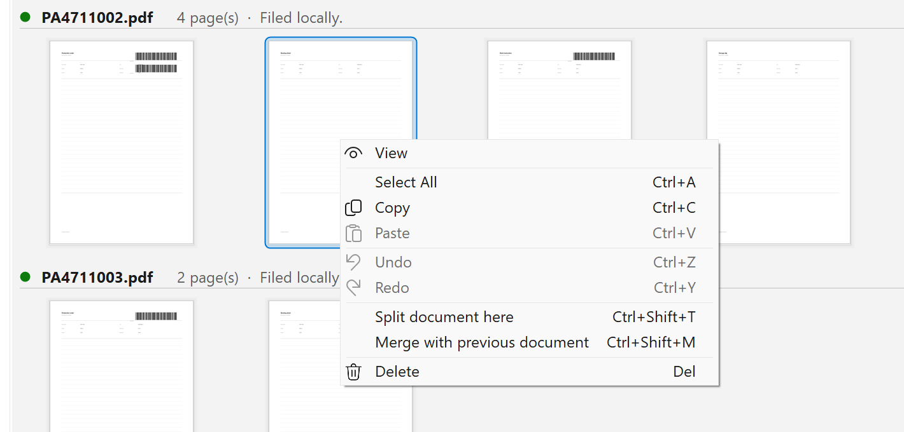

Right-click a page to open the context menu:

* **Split document here** (`Ctrl`+`Shift`+`T`) makes the selected page the **first page of a new
  document**. Everything from that page to the end of the old document goes with it.
* **Merge with previous document** (`Ctrl`+`Shift`+`M`) attaches the document to the one directly above.

**The identification follows the pages.** After a split, each half takes the barcodes that are on its own
pages: the half with the cover sheet keeps the order number, and the other half stops claiming a barcode
that left with the first half. A value typed in by hand survives the operation.

Not offered:

* Splitting at a document's **first** page — that would produce nothing.
* Splitting or merging a document that is already **in an archive**.
* Merging across **profile** boundaries.

## 6.2 Dragging a single page into another document

Sometimes only one sheet ended up with the wrong case. Just drag it where it belongs.

What decides is **the page the pointer is over**, not the insertion mark:

* Drop on the **left half** of a page → the dragged pages join **that** page's document.
* Drop on the **right half** of the page above → they join the document **above**. This is also how you
  join two whole documents.
* Drop on a **heading** → the pages go to the front of that document.

The blue bar shown while dragging is drawn inside the group the pages will land in — where the bar is is
where they go.

## 6.3 What ScanMe refuses

ScanMe refuses two kinds of edit, and says so — as a notification in the window and as a line in the
console:

**The pages of an archived document cannot be deleted or moved.** They are the record that exactly those
pages are in the archive. An edit that appears to work in the window while the archive stays as it was
would be worse than one that is refused. Only documents that actually reached an **archive** are affected
— a profile that just files into a folder still allows corrections.

**Pages do not move between documents of different profiles.** The profile decides the folder, the name
and the archive — one drag would change all three with nothing on screen saying so.

A document being written or uploaded at that moment is likewise left alone until it is done.

> **Note:** **Clear** does not count as an edit and is deliberately not refused — it is how the next
> stack starts. A finished document keeps its record either way.

<!-- pagebreak -->

# 7. Editing pages

Everything you change about a page here **also reaches the archived file** — as long as the document has
not been archived yet. A page that went through crooked does not have to be scanned again.

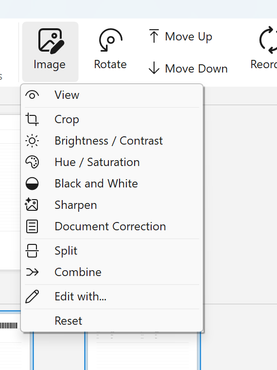

| Menu entry | What it does |
| --- | --- |
| **View** | Opens the page large, for checking. |
| **Crop** | Trims the edges. |
| **Brightness / Contrast** | Lightens a scan that came out too dark, or strengthens a faint original. |
| **Hue / Saturation** | Colour correction. |
| **Black and White** | Converts to pure black and white — smaller files for plain text. |
| **Sharpen** | Makes blurred edges clearer. |
| **Document Correction** | Straightens the page automatically and cleans up the background. Usually the only entry you need. |
| **Split** | Cuts one image into two pages — for double pages scanned as a single sheet. |
| **Combine** | Joins two pages into one. |
| **Edit with…** | Opens the page in an external program. |
| **Reset** | Undoes every edit made to this page. |

**Rotate** in the toolbar holds **Rotate Left**, **Rotate Right**, **Flip**, **Deskew** and **Custom
Rotation**. `Ctrl`+`Shift`+`Left` and `Right` rotate without going through the menu.

**Changing the order:** **Move Up** and **Move Down** move the selected pages. **Reorder** holds
**Interleave** and **Deinterleave** — for fronts and backs scanned in two passes — as well as
**Reverse**.

**Undo** (`Ctrl`+`Z`) and **Redo** (`Ctrl`+`Y`) apply to these changes too.

> **Tip:** select several pages with `Ctrl`+click or `Shift`+click and apply the correction to all of
> them at once. `Ctrl`+`A` selects every page.

<!-- pagebreak -->

# 8. Saving, printing, email, importing

Automatic filing from the profile and saving by hand are two different things. The buttons in this
chapter make **extra** copies wherever you want them; they change nothing in the archive.

| Button | Effect |
| --- | --- |
| **Save PDF** | Saves the pages as a PDF wherever you choose. The arrow beside it distinguishes **Save All** and **Save Selected**, and opens the PDF settings (compression, metadata, encryption, PDF/A). |
| **Save Images** | The same as JPEG, PNG or TIFF. |
| **Email PDF** | Creates a new email with the pages attached as a PDF. |
| **Print** | Prints the selected pages. |
| **Import** | Brings existing PDFs or images into the window. |

**Imported pages belong to no document.** They appear under the heading *Not part of a document* and are
neither filed nor uploaded. Drag them into a document (chapter 6.2) if that is where they belong.

**Text recognition (OCR):** when it is enabled, saved PDFs become searchable — the text sits invisibly
behind the image, so documents can later be found by their contents.

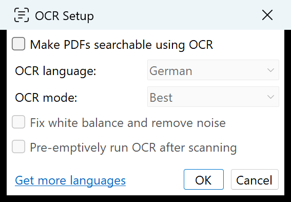

**Make PDFs searchable using OCR** turns recognition on. Below it you pick the **OCR language** — **Get
more languages** fetches any that are missing — and the **OCR mode**. **Fix white balance and remove
noise** helps with poor originals but costs extra time, and **Automatically run OCR after scanning**
saves you invoking it by hand.

> **Note:** OCR is computationally expensive. On large stacks, saving takes noticeably longer.

<!-- pagebreak -->

# 9. The console

The console is the most useful tool there is when something does not go as expected. It records **every
step** of a scan — expressly including the steps that deliberately do nothing.

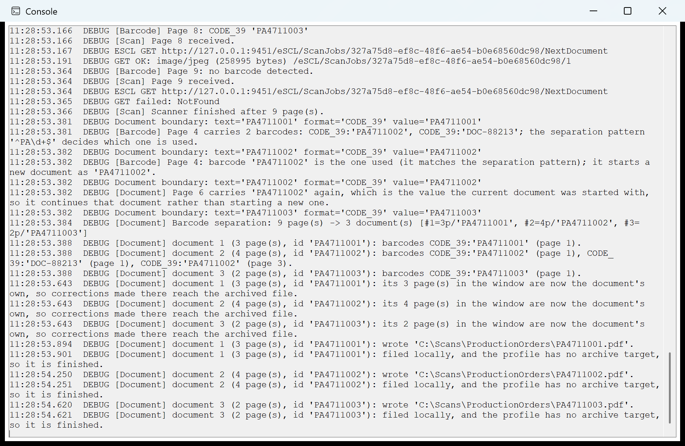

Every line starts with the time and a category in square brackets:

| Category | What it covers |
| --- | --- |
| `[Scan]` | Pages arriving from the scanner |
| `[Barcode]` | What was found on a page — and what was not |
| `[Document]` | Separation, identification, files written |
| `[Upload]` | SharePoint and SAP, with sizes, times and errors |
| `[Profile]` | What the profile asks for and what follows from it |
| `[App]` | Program start, version |

A typical excerpt answers exactly the question you ask while checking:

```
[Barcode] Page 4 carries 2 barcodes: CODE_39:'PA4711002', CODE_39:'DOC-88213';
          the separation pattern '^PA\d+$' decides which one is used.
[Barcode] Page 4: barcode 'PA4711002' is the one used (it matches the separation
          pattern); it starts a new document as 'PA4711002'.
[Document] Page 6 carries 'PA4711002' again, which is the value the current
          document was started with, so it continues that document rather than
          starting a new one.
[Document] Barcode separation: 9 page(s) -> 3 document(s)
```

The console is always available and writes nothing to disk. You can select its contents and copy them
with `Ctrl`+`C` — **that is exactly what belongs in a support request**, together with which stack was
scanned and what you expected instead.

> **When a barcode was not found**, the console states which **search area** was in force and which
> **barcode types** were looked for. Those are the two most common causes, and both are set in the
> profile (Appendix A).

<!-- pagebreak -->

# 10. Settings

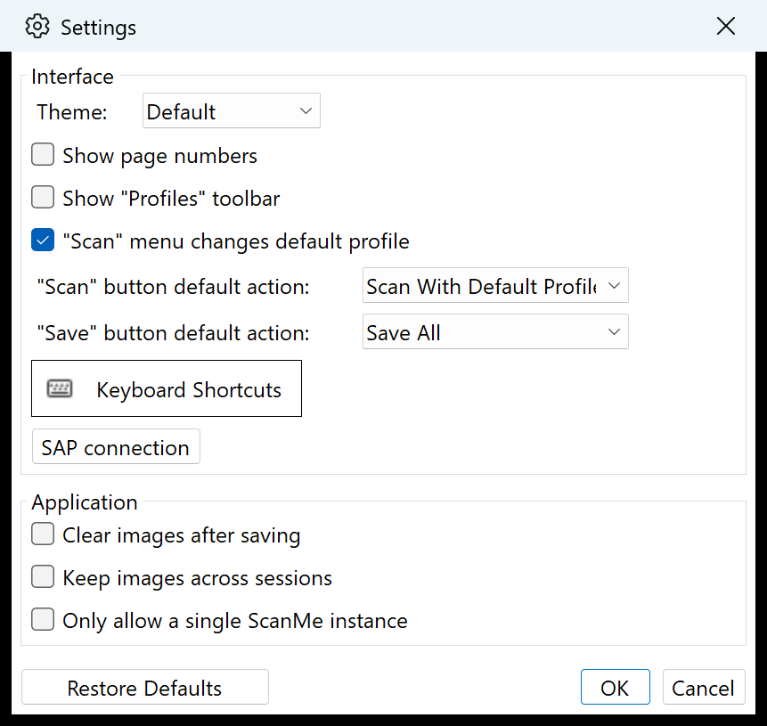

Settings apply to the program, not to an individual profile.

**Interface**

| Setting | Meaning |
| --- | --- |
| **Theme** | Light, dark, or whatever Windows is set to. |
| **Show page numbers** | Shows the page number under each thumbnail (see chapter 3.3). |
| **Show "Profiles" toolbar** | Shows an extra bar with all profiles. |
| **"Scan" menu changes default profile** | A profile picked through the arrow stays the default afterwards. |
| **"Scan" button default action** / **"Save" button default action** | What a click on the button itself — without the arrow — does. |
| **Keyboard Shortcuts** | Opens the list of every key combination, for changing them (chapter 12). |
| **SAP connection** | Credentials and the two time limits for the SAP archive (appendix A.5). |

**Application**

| Setting | Meaning |
| --- | --- |
| **Clear images after saving** | Empties the window after a save. |
| **Keep images across sessions** | The pages are still there on the next start. |
| **Only allow a single ScanMe instance** | Stops ScanMe from being started twice by accident. |

**Restore Defaults** puts everything back to how it shipped — the profiles are untouched.

The settings for **PDF**, **images** and **email** are not here; they sit behind the small arrow beside
the corresponding toolbar button.

**The language** is switched with the **Language** button in the toolbar. ScanMe rebuilds the window
afterwards; the scanned pages stay where they are.

<!-- pagebreak -->

# 11. When something goes wrong

| What you see | Likely cause | What to do |
| --- | --- | --- |
| **The whole stack became one document.** | No barcode was recognised. | Open the console: does it say "no barcode detected"? Then check that the cover sheet is printed cleanly, that the right **barcode type** is enabled in the profile, and that no **search area** is set that excludes the barcode. |
| **Too many documents — every cover sheet started one.** | **Start a new document only when the barcode value changes** is off in the profile. | Join the documents with **Merge with previous document**, then have the profile corrected. |
| **A document has one page too many or too few.** | A cover sheet was missed, or a barcode was misread. | Chapter 6: split, merge, or drag the page. |
| **The file name carries a number from somewhere else.** | The cover sheet carries several barcodes. | Select the right barcode in the inspector. In the long run, a **separation pattern** in the profile fixes it. |
| **"No identification yet, so this document is being held back."** | No barcode found, and the profile requires an identification. | Select **Own value** and type the number in. |
| **"Something went wrong."** | The upload failed. | Open the console and read the `[Upload]` lines. Then click **Retry**. The document stays in the list until then — a failed upload is never a dead end. |
| **The upload ran into a timeout.** | The connection is too slow, or SAP is not answering. | The console says which side was slow: "still sending" means the link, "waiting" means SAP. **Careful:** a document whose upload timed out may still have reached the archive. Check the archive before trying again. |
| **Deleting or moving is refused.** | The document is already in the archive, or the pages belong to different profiles. | Chapter 6.3. The message names the reason. |
| **The window keeps filling up.** | Finished documents stay on purpose. | **Remove finished**. |
| **The file in the folder still shows the old state.** | You corrected the document after it was filed. | Click **Upload** — the corrected version is written, **next to** the old one. Remove the old file yourself. |
| **The scanner is not found.** | Device off, cable out, or a network scanner unreachable. | Check the device, then pick it again under **Choose device** in the profile. |

**What helps a support request:**

1. The contents of the **console** (select, `Ctrl`+`C`).
2. Which **profile** was used.
3. What you expected and what happened instead.
4. The **version** — it is in **About**, the lower half of the button on the far right.

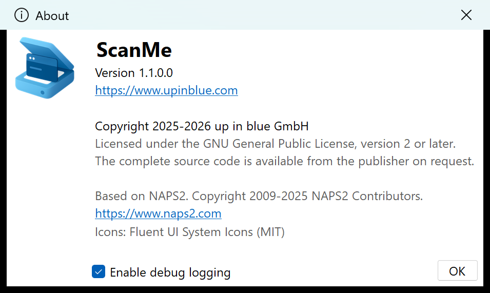

*This is where the version number is. **Enable debug logging** additionally writes a log file (see
appendix C) — leave it on while a fault is still being investigated.*

<!-- pagebreak -->

# 12. Keyboard shortcuts

| Key | Effect |
| --- | --- |
| `Ctrl`+`Enter` | Scan |
| `F2` … `F12` | Scan with the 1st to 11th profile |
| `Ctrl`+`N` | New profile |
| `Ctrl`+`L` | Profile management |
| `Ctrl`+`O` | Import |
| `Ctrl`+`S` | Save everything as PDF |
| `Ctrl`+`Shift`+`S` | Save selection as PDF |
| `Ctrl`+`I` | Save everything as images |
| `Ctrl`+`Shift`+`I` | Save selection as images |
| `Ctrl`+`E` | Email everything |
| `Ctrl`+`P` | Print |
| `Ctrl`+`A` | Select all pages |
| `Ctrl`+`C` / `Ctrl`+`V` | Copy / paste |
| `Ctrl`+`Z` / `Ctrl`+`Y` | Undo / redo |
| `Del` | Delete the selected pages |
| `Ctrl`+`Shift`+`Del` | Clear everything |
| `Ctrl`+`Up` / `Ctrl`+`Down` | Move page up / down |
| `Ctrl`+`Shift`+`Left` / `Right` | Rotate left / right |
| `Ctrl`+`Shift`+`Down` | Flip 180° |
| **`Ctrl`+`Shift`+`T`** | **Split document here** |
| **`Ctrl`+`Shift`+`M`** | **Merge with previous document** |
| `Ctrl`+`+` / `Ctrl`+`-` | Zoom thumbnails in / out |
| `Ctrl`+`B` | Batch scan |
| `F1` | About ScanMe |

Most of these can be changed under **Settings → Keyboard Shortcuts**.

<!-- pagebreak -->

# Appendix A – Setting up profiles

A **profile** is the complete description of a recurring scanning job: which scanner, how to split, what
the file is called, where it goes. It is the setup done once that then applies to every stack.

This appendix gives an overview. The detailed setup — above all the SharePoint and SAP credentials —
belongs with whoever manages those credentials.

## A.1 Profile management

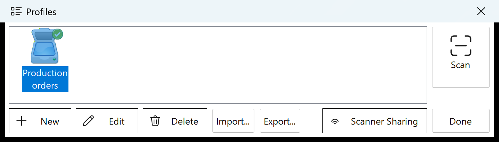

**Profiles** in the toolbar opens the list. **New**, **Edit** and **Delete** speak for themselves.

**Import…** and **Export…** carry profiles to a second machine. Export writes the selected profiles, or
all of them when nothing is selected; imported profiles are appended and never overwrite an existing one.
**Neither the SAP password nor the SharePoint client secret travels with them**: the SAP password is tied
to one user on one machine and is unusable elsewhere anyway, and the client secret would otherwise sit in
plain text in a file somebody mails to themselves. Both have to be entered again on the target machine;
ScanMe says on import which profiles are affected.

*These two buttons were added after version 1.1.0.0. Older installations do not have them.*

## A.2 The "Scanner" tab

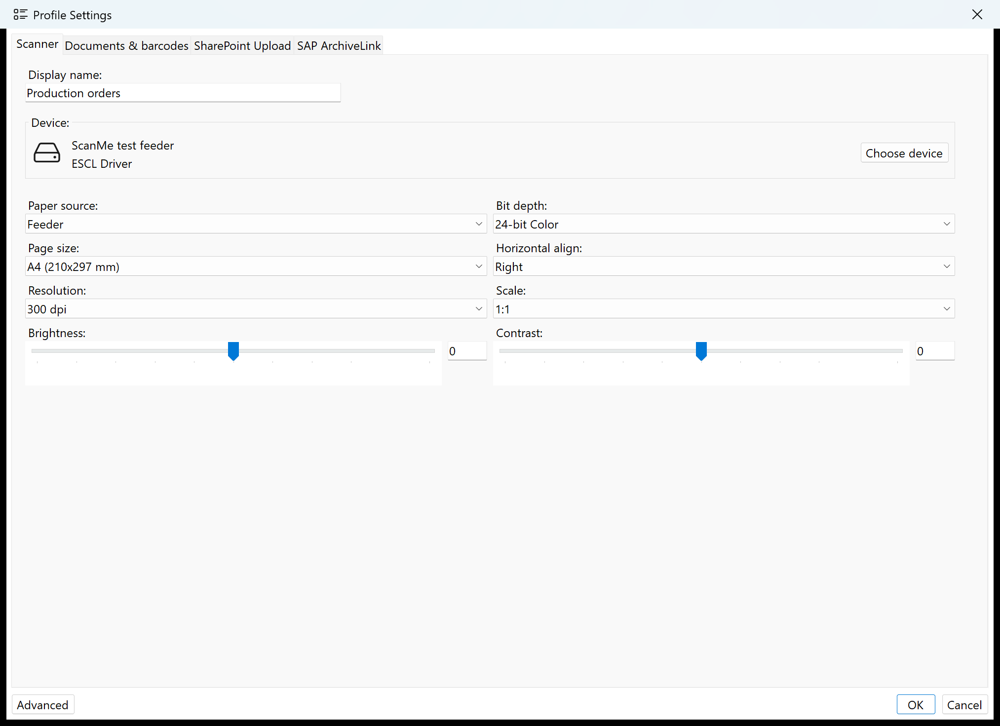

**Display name** is what the profile is called in the list. **Choose device** lists the connected WIA and
TWAIN scanners as well as network devices (ESCL). Below that come the capture settings: **Paper source**
(flatbed or feeder, one- or two-sided), **Page size**, **Resolution**, **Bit depth**, **Horizontal
align**, **Scale**, **Brightness** and **Contrast**. **Advanced** at the bottom left holds the special
cases, such as skipping blank pages.

> **For barcode separation, 300 dpi is the sensible starting point.** Less makes narrow bars unreadable;
> more only costs time and space.

## A.3 The "Documents & barcodes" tab

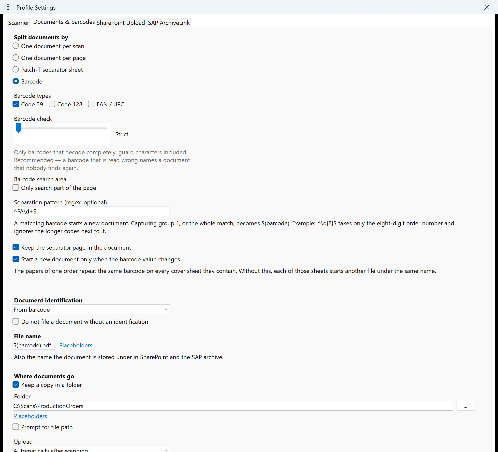

**Split documents by** — how a stack becomes documents:

| Setting | Effect |
| --- | --- |
| **One document per scan** | The whole stack becomes one file. |
| **One document per page** | Every page becomes a file. |
| **Patch-T separator sheet** | Split at inserted patch-T cards. The card itself never becomes part of a document — it is reusable. |
| **Barcode** | Split at the barcodes on the cover sheets. |

**Barcode types** — at least one has to be ticked. Without a restriction ScanMe tries every format it
knows, and table rules or dense print then decode into barcodes that are not on the paper at all.
**EAN / UPC is the riskiest format** — eight digits with no usable self-check — which is why the dialog
warns when it is on.

**Barcode check** — how damaged a printed barcode may be:

* **Strict** (the default) only accepts barcodes that decode completely. That is the right choice unless
  something argues against it.
* **Tolerant** and **Very tolerant** additionally accept Code 39 barcodes whose stop character is printed
  wrong. Only pick these if codes are demonstrably being missed. Values accepted this way are named in
  the console.

**Barcode search area** — the most effective protection there is against a misread barcode.

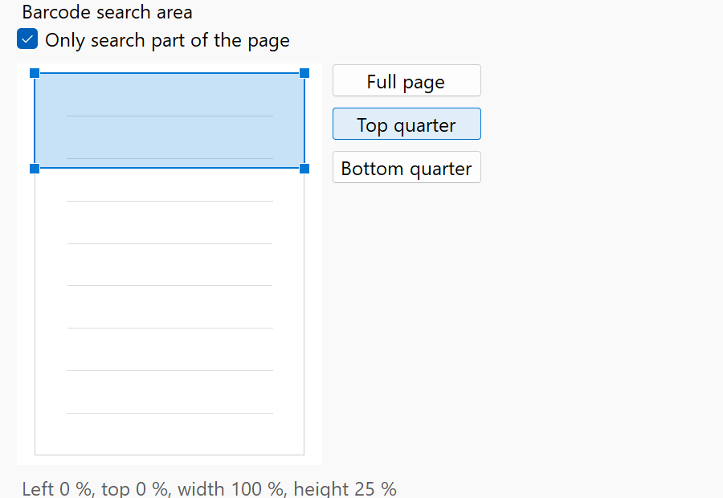

If your paperwork always carries the barcode in the same place, drag the area out on the page. Everything
outside it is ignored — no table rule can be read as a barcode there. Three presets (**Full page**,
**Top quarter**, **Bottom quarter**) cover the usual cases. The setting is off for existing profiles for
a good reason: a restriction introduced by an update would quietly blind a working profile.

**Separation pattern (regex, optional)** — when the cover sheet carries several barcodes, this pattern
decides which one is meant. Example: `^PA\d+$` takes only codes that start with `PA` and are otherwise
all digits. What is captured in group 1, or the whole match, becomes the identification.

**Keep the separator page in the document** — whether the cover sheet stays part of the document. With
barcode separation, usually yes: it is the case's own cover sheet.

**Start a new document only when the barcode value changes** — leave this on. Without it, every further
cover sheet of the same order starts another file with the same name.

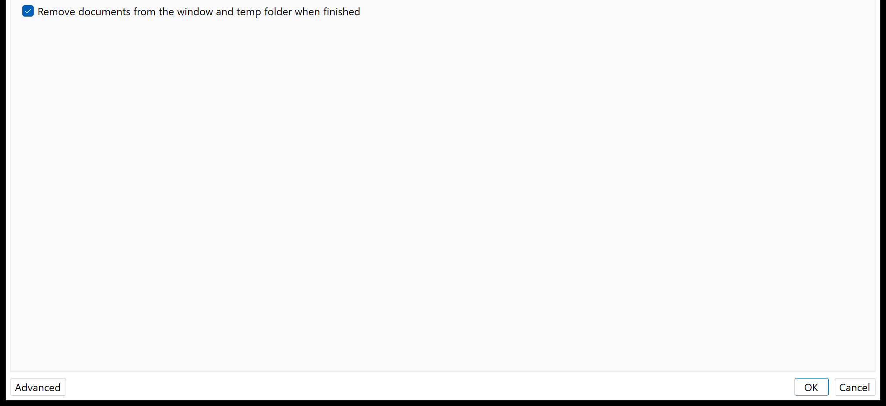

**Document identification** — where the identification comes from: **From barcode**, **Ask after
scanning** or **None**. **Do not file a document without an identification** holds documents back rather
than filing them under a stand-in name.

**File name** — the name of the file, and at the same time the name in SharePoint and the SAP archive.
**Placeholders** offers, among others:

| Placeholder | Produces |
| --- | --- |
| `$(barcode)` | The document's identification — the barcode the separation pattern selected |
| `$(id)` | The identification as well, including a value typed by hand |
| `$(barcode:2)` | The second barcode on the document |
| `$(barcode:type=QR)` | The first barcode of a given type |
| `$(YYYY)` `$(MM)` `$(DD)` | Year, month, day |
| `$(hh)` `$(mm)` `$(ss)` | Hour, minute, second |
| `$(n)` … `$(nnnn)` | A running number |
| `$(profile)` `$(user)` `$(host)` | Profile name, user, machine |

A typical value is `$(barcode).pdf`. An identification corrected in the inspector reaches both
placeholders — the file name follows the correction.

**Where documents go** — **Keep a copy in a folder** with the folder path (placeholders work here too),
**Prompt for file path** for a confirmation dialog on every scan, and **Upload**: *Automatically after
scanning* or *Manually via button*.

Filing, uploading and the trigger are **three separate settings**. "Keep nothing locally, upload on the
button" is therefore a combination you can simply select.

**Remove documents from the window and temp folder when finished** — tidies up automatically once
archiving has succeeded.

## A.4 The "SharePoint Upload" tab

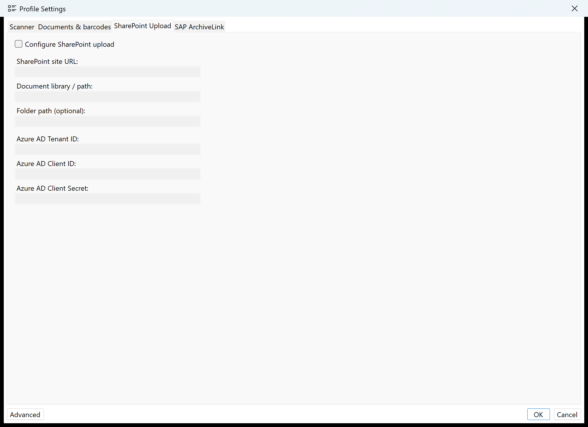

**Configure SharePoint upload** turns the upload on. Below it: **SharePoint site URL**, **Document
library / path** and **Folder path (optional)** — the folder path takes the same placeholders as the file
name, `$(barcode)` included — plus the credentials of the application registered in Azure: **Azure AD
Tenant ID**, **Azure AD Client ID** and **Azure AD Client Secret**.

## A.5 The "SAP ArchiveLink" tab

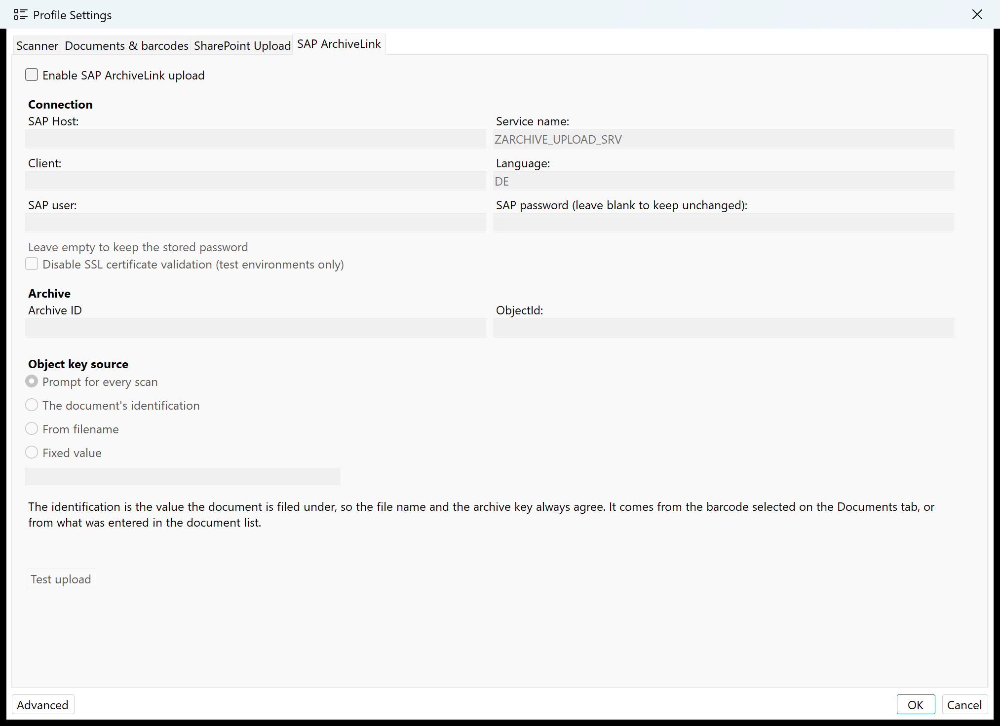

**Enable SAP ArchiveLink upload** turns the upload on. Below it:

* **Connection** — SAP host, service name, client, language, SAP user and SAP password. The password box
  comes up empty when you edit a profile; leaving it empty keeps the stored password. **Disable SSL
  certificate validation** is expressly for test environments only.
* **Archive** — **Archive ID** and **ObjectId**.
* **Object key source** — where the key SAP files the document under comes from: **The document's
  identification** (the normal case — the file name and the archive key then always agree), **From
  filename**, **Fixed value**, or **Prompt for every scan**. For the first two, a regex can be given that
  cuts just part of the value out.

**Test upload** sends a PDF of your choice to the archive as a trial — the quickest way to find out
whether the connection works. What happens is written line by line into the console.

The connection's **time limits** live under **Settings → SAP connection**: one for signing in (30 seconds
by default) and one for the upload including the archiving behind it (300 seconds by default). Both are
named in the console on every upload.

<!-- pagebreak -->

# Appendix B – Glossary

**Barcode** — The bar code on the paper. ScanMe reads Code 39, Code 128 and EAN/UPC.

**Document** — A group of pages that belong together and are filed as one PDF. Created when the stack is
split.

**Identification** — The value a document is filed under. It normally comes from the cover sheet's
barcode but can be changed by hand. It decides the file name, the SharePoint folder and the SAP object
key at the same time.

**Patch-T** — A standardised separator sheet with a fixed bar pattern. A reusable card; never part of a
document.

**Profile** — The stored description of a scanning job: device, separation, file name, destination.

**Regex (regular expression)** — A search pattern for text. In ScanMe it decides which of several
barcodes is meant.

**ArchiveLink** — The SAP interface through which documents reach the SAP archive.

**Object key** — The key under which SAP assigns an archived document to a business object.

**OCR / text recognition** — Turns the image of text into searchable text.

**Separation pattern** — The regular expression that decides which barcode starts a new document.

<!-- pagebreak -->

# Appendix C – Where ScanMe keeps its data

| What | Where |
| --- | --- |
| Profiles | `%APPDATA%\ScanMe\profiles.xml` |
| Program settings | `%APPDATA%\ScanMe\config.xml` |
| Log files | `%APPDATA%\ScanMe\debuglog.txt`, `errorlog.txt` |
| Recovery data | `%APPDATA%\ScanMe\recovery` |
| Intermediate files | `%APPDATA%\ScanMe\temp` |
| Filed documents | In the folder the profile in question names |

**Recovery after a crash:** on the next start ScanMe asks whether the pages of the last session should be
recovered. **Recover** brings them back, **Not Now** leaves them alone (the question returns on the next
start), and **Delete** discards them for good.

---

<div align="center">

**ScanMe** · © 2025–2026 up in blue GmbH · [www.upinblue.com](https://www.upinblue.com)

ScanMe is built on [NAPS2](https://www.naps2.com).

</div>
