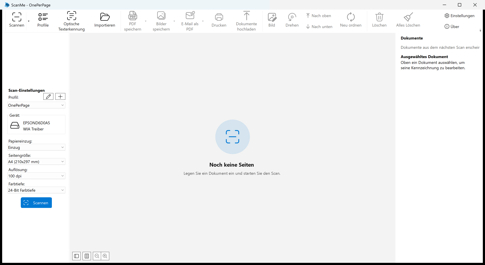

# ScanMe 1.0.16.0

Erste veröffentlichte Version · 18. August 2026

---

## Deutsch

ScanMe ist eine Scan-Anwendung für Windows, die gescannte Papiere automatisch in Dokumente trennt, sie
nach ihrem Barcode benennt und sie nach SharePoint und in das SAP-Archiv hochlädt. Dies ist die erste
öffentlich veröffentlichte Version.

*Das Hauptfenster: links die Scan-Einstellungen, in der Mitte die Seiten, rechts die Dokumentenliste mit
dem Inspektor. Gezeigt ohne eingelegtes Papier, daher noch ohne Seiten.*

### Scannen

- Unterstützt WIA-, TWAIN- und ESCL-Scanner (Netzwerk).
- Speichert als PDF, TIFF, JPEG oder PNG, wahlweise mit Texterkennung (OCR).
- Scan-Profile halten Gerät, Papiereinzug, Seitengröße, Auflösung und Farbtiefe fest, sodass ein
  wiederkehrender Vorgang mit einem Klick startet.

### Dokumententrennung über Barcode

- Ein Stapel wird an den Barcodes getrennt, die auf den Deckblättern stehen — Code 39, Code 128,
  EAN/UPC oder Patch-T-Trennblätter.
- **Ein wiederholter Barcode setzt das Dokument fort, statt eine Kopie davon zu beginnen.** Die Papiere
  eines Fertigungsauftrags tragen die Auftragsnummer auf jedem enthaltenen Deckblatt; ohne diese Regel
  entstünden daraus mehrere Dateien mit identischem Namen. Ein Stapel mehrerer Aufträge wird weiterhin
  dort getrennt, wo die Nummer wechselt.
- Patch-T-Trennblätter sind wiederverwendbare Karten und werden nie Teil des Dokuments.
- Über einen regulären Ausdruck lässt sich festlegen, welcher Barcode gemeint ist, wenn ein Blatt
  mehrere trägt.

### Ablage und Archivierung

- **Der Barcode, der ein Dokument getrennt hat, ist der Wert, unter dem es abgelegt wird.** Er benennt
  die Datei, bestimmt den SharePoint-Ordner und liefert den SAP-Objektschlüssel — die drei können damit
  nicht auseinanderlaufen.
- Upload nach **SharePoint** über Microsoft Graph, in eine wählbare Bibliothek und einen Unterordner.
- Upload in das **SAP-Archiv** über ArchiveLink, mit Archiv-ID und Objektschlüssel pro Profil.
- Lokales Speichern, Hochladen und der Auslöser sind drei getrennte Einstellungen. „Nichts lokal
  behalten, auf Knopfdruck hochladen" ist damit eine Kombination, die sich einfach auswählen lässt.
- Ein Dokument, dessen Kennzeichnung fehlt, wird zurückgehalten statt unter einem Platzhalternamen
  abgelegt — ein falsch benanntes Dokument findet im Archiv niemand wieder.

### Prüfen und korrigieren, bevor archiviert wird

- Die Dokumentenliste zeigt jedes Dokument des Vorgangs mit seinem Status. Der Inspektor daneben zeigt
  die erkannten Barcodes als Auswahl — der markierte ist die Kennzeichnung — plus ein Feld für einen
  eigenen Wert.
- Eine hier vorgenommene Korrektur erreicht den Dateinamen, den SharePoint-Ordner und den
  SAP-Objektschlüssel gemeinsam.
- **Ein fehlgeschlagener Upload ist keine Sackgasse.** Das Dokument bleibt in der Liste und lässt sich
  aus seiner eigenen Zeile heraus erneut hochladen. Fällt ein Ziel aus, wird das andere trotzdem
  bedient.

### Diagnose

- Eine Konsole („Konsole" in der Symbolleiste) protokolliert jeden Schritt von Scan über Barcode-Erkennung
  und Trennung bis zum Upload — **auch dann, wenn ein Schritt bewusst nichts tut.** Genau das ist der
  Fall, der sich sonst nicht aufklären lässt: nicht der Absturz, sondern der Schritt, der still nichts
  bewirkt.

### Oberfläche

- Vollständig deutschsprachige Oberfläche.
- Im Fluent-Stil von Windows 11 gezeichnet, mit Unterstützung für den hellen und den dunklen Modus und
  für die vom Benutzer gewählte Akzentfarbe.

### In dieser Version zusätzlich

- Der Info-Dialog wurde neu gestaltet: eigenes Produktbild, aktuelles Copyright, korrekte Nennung der
  verwendeten Symbolbibliothek und ein Hinweis auf NAPS2 als zugrundeliegendes Projekt.
- Der Installer legt wieder einen Eintrag im Windows-Startmenü an. Auf Rechnern, auf denen jemals NAPS2
  installiert war, unterblieb er zuvor vollständig.
- Der Installer nennt „up in blue GmbH" als Herausgeber und zeigt die Lizenz von ScanMe statt der von
  NAPS2.

### Systemvoraussetzungen

Windows 10 Version 1607 oder neuer, 64 Bit.

### Lizenz

ScanMe ist freie Software unter der GNU General Public License, Version 2 oder höher. Es baut auf
[NAPS2](https://www.naps2.com) auf (Copyright 2009-2025 NAPS2 Contributors). Der vollständige Quellcode
liegt dem Release bei und ist unter https://github.com/upinblue/ScanMeX abrufbar.

---

## English

ScanMe is a Windows scanning application that splits scanned paper into documents automatically, names
them after their barcode, and uploads them to SharePoint and the SAP archive. This is the first publicly
released version.

*The main window: scan settings on the left, pages in the middle, the document list and its inspector on
the right. Shown with no paper loaded, hence no pages yet.*

### Scanning

- Supports WIA, TWAIN and ESCL (network) scanners.
- Saves as PDF, TIFF, JPEG or PNG, optionally with optical character recognition.
- Scan profiles hold the device, paper source, page size, resolution and bit depth, so a recurring job
  starts with one click.

### Barcode document separation

- A stack is split at the barcodes printed on its cover sheets — Code 39, Code 128, EAN/UPC, or patch-T
  separator sheets.
- **A repeated barcode continues the document instead of starting a copy of it.** The papers of one
  process order carry the order number on every cover sheet they contain; without this rule that would
  yield several files with identical names. A stack of several orders is still split where the number
  changes.
- Patch-T separator sheets are reusable cards and never become part of the document.
- A regular expression decides which barcode is meant when a sheet carries more than one.

### Filing and archiving

- **The barcode that separated a document is the value it is filed under.** It names the file, decides
  the SharePoint folder and supplies the SAP object key, so the three cannot drift apart.
- Upload to **SharePoint** through Microsoft Graph, into a chosen library and subfolder.
- Upload to the **SAP archive** through ArchiveLink, with a per-profile archive ID and object key.
- Saving locally, uploading, and the trigger are three separate settings. "Keep nothing locally, upload
  on the button" is therefore a combination you can simply select.
- A document whose identification is missing is held back rather than filed under a stand-in name — a
  wrongly named document in an archive is not something anyone finds again.

### Check and correct before archiving

- The document list shows every document of the session with its status. The inspector beside it shows
  the detected barcodes as a choice — the selected one is the identification — plus a field for your own
  value.
- A correction made here reaches the file name, the SharePoint folder and the SAP object key together.
- **A failed upload is not a dead end.** The document stays in the list and can be retried from its own
  row. If one target is down, the other is still served.

### Diagnostics

- A console ("Konsole" in the toolbar) logs every step from scan through barcode detection and separation
  to upload — **including when a step deliberately does nothing.** That is the case that is otherwise
  impossible to diagnose: not the crash, but the step that quietly has no effect.

### Interface

- Fully German-language interface.
- Drawn in the Windows 11 Fluent style, with light and dark mode and the user's chosen accent colour.

### Also in this version

- The About dialog was redesigned: its own product image, a current copyright line, the correct icon
  library credited, and NAPS2 named as the underlying project.
- The installer creates a Windows Start menu entry again. On machines that had ever had NAPS2 installed
  it previously created none at all.
- The installer names "up in blue GmbH" as the publisher and shows ScanMe's licence rather than NAPS2's.

### Requirements

Windows 10 version 1607 or later, 64-bit.

### Licence

ScanMe is free software under the GNU General Public License, version 2 or later. It builds on
[NAPS2](https://www.naps2.com) (Copyright 2009-2025 NAPS2 Contributors). The complete source code is
attached to this release and available at https://github.com/upinblue/ScanMeX.
