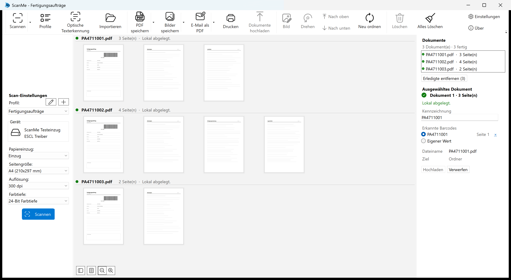

# ScanMe 1.1.0.0

20 August 2026 · Upgrade from 1.0.16.0

ScanMe is a Windows scanning application that splits scanned paper into documents automatically, names
them after their barcode, and uploads them to SharePoint and the SAP archive.

This release is about the scan window. The pages in the middle are now grouped under the document they
belong to, and a stack that was separated in the wrong place can be put right there — by dragging a page
into another document, or by splitting and merging whole documents — before anything is filed or
uploaded.

*Three process orders, split at the barcodes on their cover sheets. Each document is its own section in
the middle of the window, headed with the file it is filed as, its page count and its status; the
document list and its inspector are on the right.*

## New

- **The pages are grouped by the document they belong to.** Each document is its own section, headed with
  the name of the file it will be filed as. Page numbers count within the document (`2 / 4`) rather than
  across the batch, because which page of *this* document it is answers the question the operator has.
  Pages that belong to no document get their own section ("Zu keinem Dokument").
- **Move a page into another document by dragging it there.** Drop it on the left half of a page and it
  joins that page's document; drop it on the right half of the page above and it joins the one above —
  which is also how two documents are merged into one. The drop indicator is drawn inside the section the
  pages will land in, so where the bar is is where they go.
- **Split a document, or merge it with the one above it.** "Dokument hier trennen" and "Mit vorherigem
  Dokument verbinden" are in the context menu in the scan window, and on Ctrl+Shift+T and Ctrl+Shift+M.
  This is what a missed separator sheet costs to repair: one boundary rather than a dozen pages. **The
  identification follows the pages** — the half that keeps the cover sheet keeps the order number, and the
  half without it stops claiming a barcode that left with the other half. A value typed in by hand
  survives the operation, because it was a correction of exactly this.
- **"Erledigte entfernen" clears the documents that are through** out of the list, and takes their pages
  out of the window with them. A day of scanning otherwise leaves a list that only grows. Nothing is
  deleted from disk.
- **Selecting works both ways.** Picking a document in the list selects its pages, selecting pages that
  all sit in one document points the inspector at that document, and clicking a section heading takes hold
  of every page of that document at once.
- **Barcodes can be looked for in one part of the page only.** Paperwork that always carries its barcode
  in the same place can have the rest of the sheet ignored — which is the strongest defence there is
  against a barcode read out of a ruled table, because what isn't looked at can't decode. The area is
  drawn on a page in the profile settings, with three presets, and every scan says in the console which
  area was in force. Off for every profile that already exists.
- **An edit that is refused now says so**, as a notification and in the console. The pages of a document
  that has already reached an archive cannot be deleted or moved — they are the record that exactly those
  pages are in there — and pages do not move between documents that were scanned with different profiles,
  because the profile decides the folder, the name and the archive.

## Improved

- **Only documents that reached an archive are locked, not every finished document.** A profile that just
  files into a folder no longer freezes its documents the moment they are written: their pages can still
  be corrected. A document that is being written or uploaded at that moment is left alone until it is
  done.
- **Correcting a filed document now leads somewhere.** Change its pages or its identification and it goes
  back into the queue, its status says the file on disk is no longer current, and the upload button writes
  the corrected version **next to** the old one — a file in your own folder stays yours.
- **A correction reaches the whole window as it is typed.** The row in the document list and the heading
  over the pages both name a document by the file it would be filed as, and both now follow the
  identification on every keystroke instead of waiting for the field to lose focus.
- **Page edits reach the archived file.** A page straightened, cropped, rotated or deleted in the window is
  straightened, cropped, rotated or deleted in the document that is filed and uploaded.

## Fixed

- **Changing the interface language no longer kills the application.** The scan window disappeared while
  the process kept running, so the only way out was the task manager — and because the language is saved
  before the window is rebuilt, the next start came up correctly and made it look as though the setting
  had simply worked.
- **A profile that only files locally no longer reports a failed upload.** Its documents stayed "waiting to
  be uploaded" for ever, the upload button stayed lit, and pressing it reported a failure — for a document
  that had been filed exactly as asked. Such a document is finished as soon as its file is written now,
  and the status line reads "Lokal abgelegt" instead of naming a queue that does not exist.
- Picking a detected barcode in the inspector no longer blanks the panel and clears the selection, so a
  correction no longer means selecting the document again afterwards.
- Rotating every page of a document no longer looked as though all of its pages had been deleted, which
  took the document out of the list.
- A page dragged to the front of a document no longer joined the document *before* it and came to rest at
  its end; and dragging a page onto the document directly above it no longer did nothing at all.
- Dragging a page into another document no longer drew a finished document's pages in the middle of the
  document they had been dropped into, which read as that document having been split at the drop position.

## Requirements

- **Windows 10 version 1809 (build 17763) or later, 64-bit.** Windows 11 is supported.
- **No separate .NET installation.** The runtime ships inside the application.
- A WIA, TWAIN or ESCL (network) scanner. The 32-bit TWAIN worker is installed alongside.
- About 250 MB of disk space.
- SharePoint upload needs a Microsoft Entra ID app registration (tenant, client ID and secret) with
  access to the target site; SAP upload needs a reachable ArchiveLink endpoint and an archive ID.

## Upgrading

Install over the existing version — profiles and settings are kept. Nothing in this release changes how an
existing profile scans, separates or files: barcodes are still looked for on the whole page unless you
draw an area yourself, and no profile starts splitting documents differently.

## Licence

ScanMe is free software under the GNU General Public License, version 2 or later. It builds on
[NAPS2](https://www.naps2.com) (Copyright 2009-2025 NAPS2 Contributors). The complete source code is
attached to this release and available at https://github.com/upinblue/ScanMeX.
