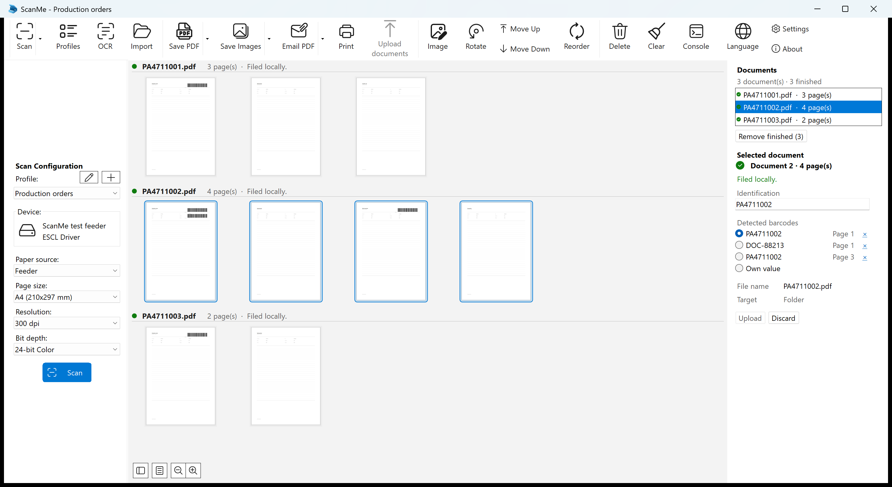

# ScanMe 1.1.1.0

27 August 2026 · Upgrade from 1.1.0.0

ScanMe is a Windows scanning application that splits scanned paper into documents automatically, names
them after their barcode, and uploads them to SharePoint and the SAP archive.

This release is about the two things that happen around a scan rather than to it: setting a second
workstation up, which used to mean retyping every profile by hand, and what the SAP upload does when SAP
takes its time. Nothing changes about how paper is scanned, separated or filed.

*The scan window is unchanged in this release: three process orders, split at the barcodes on their cover
sheets, each document its own section in the middle of the window with the document list and its inspector
on the right.*

## New

- **Profiles can be carried to another machine.** "Import..." and "Export..." are in the Profiles window,
  as buttons beside New, Edit and Delete and in the list's right-click menu. Export writes the selected
  profiles, or all of them when nothing is selected. The file is an ordinary ScanMe profile file — it can
  be opened and checked, and a `profiles.xml` taken straight out of the application data folder, including
  one written by an older version, imports as it stands.
- **An import never overwrites anything.** Profiles are added, and a name that is already in use is
  numbered ("Production orders (2)") rather than duplicated, so importing the same file twice is visible
  instead of leaving two rows nobody can tell apart. An imported profile becomes the default scan profile
  only on a machine that has none.
- **Neither secret travels with a profile.** The SAP password and the SharePoint client secret are left
  out of the exported file, and dropped again on the way in, so the rule holds whichever file is opened.
  The SAP password is protected for one user on one computer and would be unusable on another one anyway;
  the client secret would travel readable in a file someone mails to themselves. After an import ScanMe
  names the profiles that upload somewhere and therefore still need a password or a client secret entered
  before they can. Everything else goes over whole, the scanner included.
- **The SAP upload has two time limits of its own, and both can be set.** "Sign-in timeout (seconds)",
  30 by default, and "Upload timeout (seconds)", 300, in the SAP connection dialog. There used to be one
  hard limit of 60 seconds covering connecting, sending every byte, SAP archiving the document *and*
  reading the answer — which a large colour scan over a slow line does not fit into. Existing connections
  take the new defaults, and both values are named in the console on every upload.

*"Import..." and "Export..." sit beside New, Edit and Delete in the Profiles window.*

## Improved

- **The progress bar keeps moving while SAP archives the document.** Handing the bytes over is the fast
  part and now takes a quarter of the bar; the wait for SAP carries the rest, with the status line
  counting the seconds out loud — "Waiting for SAP to archive PA4711001.pdf (24 s)". Measured before this:
  the bar reached 90% in a single millisecond and then stood still for the remaining eight seconds, which
  is exactly what a hung upload looks like.
- **The console now reports the transfer itself** — the size of the document, the sign-in, a retry, a
  timeout. The HTTP half of a SAP upload used to report nothing at all, so a timeout could not be traced
  to anything. It now says which side ran out of time: still sending means the line is too slow for the
  document, sent and waiting means SAP is the slow part.
- **A stored SAP password is visible as five dots** in the profile's SAP settings. The box used to start
  empty whatever was stored, which is indistinguishable from "no password". What the box shows is now what
  is saved — and clearing it removes the stored password, where an empty box used to mean "keep it", which
  also meant there was no way to remove one at all.

## Fixed

- **A SAP upload that ran out of time is no longer sent again.** It was treated as a dropped connection,
  so the whole document went out up to three times — but a request that timed out has been received as far
  as ScanMe knows, and SAP may be archiving it at that moment. Those were up to three copies filed under
  one barcode, which afterwards is indistinguishable from having scanned the stack three times. A
  connection that genuinely failed, and therefore carried nothing, is still retried.
- **A slow SAP is no longer reported as an upload you cancelled.** A gateway that simply did not answer
  produced the message meant for pressing Cancel. The message now says what actually happened, how long
  ScanMe waited, and that the document may already be in SAP and is worth checking there before it is
  uploaded again.
- The label above the SAP password field is no longer cut off at the edge of the panel.

## Requirements

- **Windows 10 version 1809 (build 17763) or later, 64-bit.** Windows 11 is supported.
- **No separate .NET installation.** The runtime ships inside the application.
- A WIA, TWAIN or ESCL (network) scanner. The 32-bit TWAIN worker is installed alongside.
- About 250 MB of disk space.
- SharePoint upload needs a Microsoft Entra ID app registration (tenant, client ID and secret) with
  access to the target site; SAP upload needs a reachable ArchiveLink endpoint and an archive ID.

## Upgrading

Install over the existing version — profiles and settings are kept. Nothing in this release changes how an
existing profile scans, separates or files. Existing SAP connections pick up the new time limits (30
seconds for the sign-in, 300 for the upload) in place of the single 60-second limit they had before; both
can be adjusted in the SAP connection dialog.

## Licence

ScanMe is free software under the GNU General Public License, version 2 or later. It builds on
[NAPS2](https://www.naps2.com) (Copyright 2009-2025 NAPS2 Contributors). The complete source code is
attached to this release and available at https://github.com/upinblue/ScanMeX.
