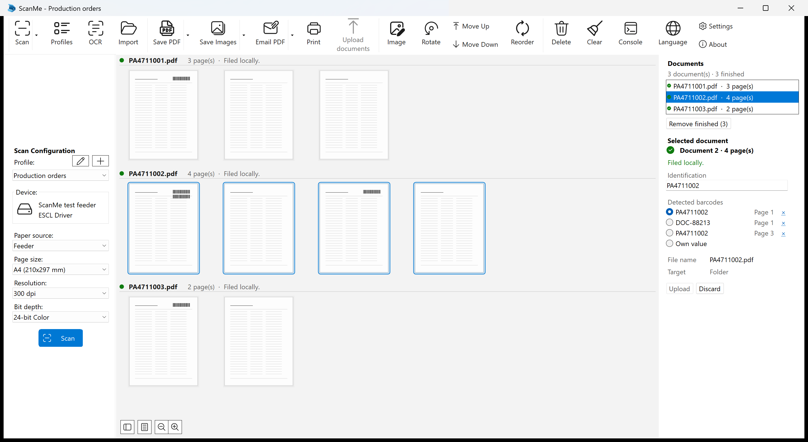

# ScanMe 1.1.2.0

16 September 2026 · Upgrade from 1.1.1.0

ScanMe is a Windows scanning application that splits scanned paper into documents automatically, names
them after their barcode, and uploads them to SharePoint and the SAP archive.

This release fixes one thing: the last page of a scan could be drawn outside the document it belongs to.
Nothing else changes — not how paper is separated, not what is filed, not what is uploaded.

*Three process orders, split at the barcodes on their cover sheets. Each document is its own section in
the middle of the window, headed with the file it will be filed as — and every one of its pages is drawn
under that heading, which is what this release puts right. The document list and its inspector are on the
right; the second order carries its barcode again on its third sheet, which continues the document rather
than starting a second copy of it.*

## Fixed

- **The last page of a scan is drawn under its own document again.** When a scan produced a single
  document, the scan window showed every page but the last one under that document's heading; the last
  page sat above them under a separate "Default" heading, as though it belonged to no document. A stack
  that separated into several documents was usually drawn correctly, which is why the same paperwork
  could look right as a stack and wrong when one document out of it was scanned on its own.

  **It was only ever the picture.** The document itself always had all of its pages: the document list on
  the right showed the correct count, the section heading itself said "26 page(s)" over 25 of them, and
  the file that reached the folder or the archive contained every page. Nothing that was filed or
  uploaded was affected, and no document had to be scanned again.

  The scan window keeps up with an arriving scan on a short delay, and the headings were worked out
  against pages that had arrived but were not on screen yet — so the pages past the end were left out of
  every section, and the next refresh, being identical, never put it right. The headings are now worked
  out over exactly the pages the window is showing.

- **Clicking a document's heading selects the right pages** in the same situation. It picks the pages out
  by position, and it had the same fault.

## Requirements

- **Windows 10 version 1809 (build 17763) or later, 64-bit.** Windows 11 is supported.
- **No separate .NET installation.** The runtime ships inside the application.
- A WIA, TWAIN or ESCL (network) scanner. The 32-bit TWAIN worker is installed alongside.
- About 250 MB of disk space.
- SharePoint upload needs a Microsoft Entra ID app registration (tenant, client ID and secret) with
  access to the target site; SAP upload needs a reachable ArchiveLink endpoint and an archive ID.

## Upgrading

Install over the existing version — profiles and settings are kept. Nothing in this release changes how an
existing profile scans, separates, files or uploads, so no profile needs adjusting.

## Licence

ScanMe is free software under the GNU General Public License, version 2 or later. It builds on
[NAPS2](https://www.naps2.com) (Copyright 2009-2025 NAPS2 Contributors). The complete source code is
attached to this release and available at https://github.com/upinblue/ScanMeX.
